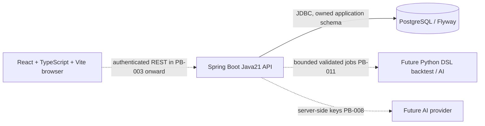
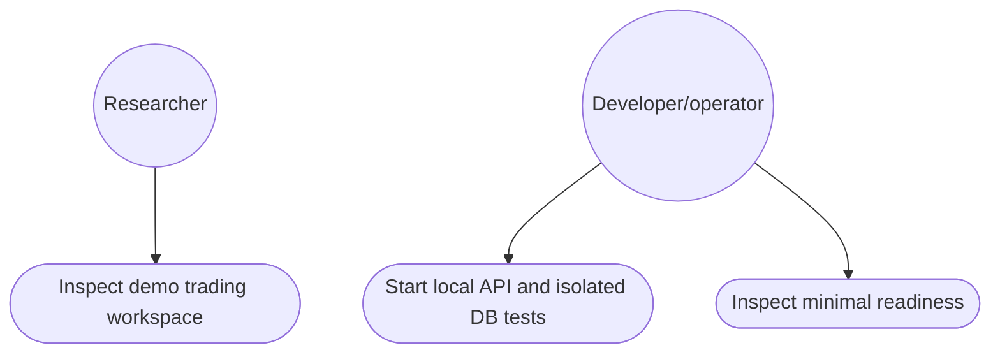

# Prototype architecture and CNPM physical view

Status: PB-001 delivered; PB-002 foundation implementing. Diagrams distinguish
current boundaries from future modules. No AI/trading runtime is claimed yet.

Frontend is a separate local demo today. Backend foundation exposes only minimal
DB readiness; all future private API paths deny access until their authenticated
feature is implemented. No browser→DB/Python/provider-key shortcut is allowed.
Native PostgreSQL tests use a fresh project-owned cluster, not the user service.
Local developer compose, if used, binds DB port to loopback and needs an environment
password; it never defaults to trust authentication or a hardcoded credential.

This is the currently supported use-case diagram. Add authenticated research,
chat/strategy/backtest/journal/knowledge use cases only as their PB items are built.
Per-feature sequence/class diagrams are in specs/PB-001 and specs/PB-002.

ERD currently has no business entities. Flyway owns trading.flyway_schema_history
(installed_rank PK, version, description, type, script, checksum, installed_by,
installed_on, execution_time, success). PB-003 creates users/sessions; later
features own their additive migrations and ownership foreign keys. Never invent a
completed overall ERD from planned tables. PB-026 reconciles this file with code.
