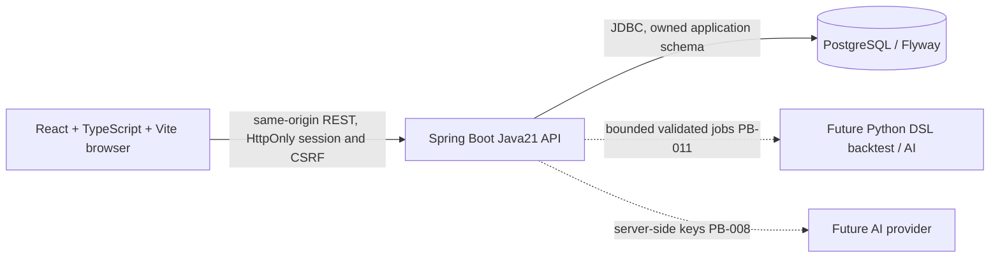
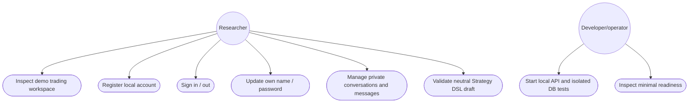

# Prototype architecture and CNPM physical view

Status: PB-001/PB-002/PB-003 delivered; PB-004 persistent conversations implemented, verification in progress. Diagrams distinguish
current boundaries from future modules. No AI/trading runtime is claimed yet.

PB-004 adds owner-scoped conversation/message APIs and additive FlywayV3. JDBC
transactions lock current user then owned conversation for quota/idempotency/version
checks. React chat state lives below the authenticated identity root, above the
responsive renderers; delayed responses cannot mix contexts. Detailed sequence,
class and ERD views are in specs/PB-004/design.md. No new infrastructure/dependency.

The frontend auth entrypoint calls the real API; the trading shell remains a demo.
Backend exposes readiness and auth/account APIs; all future private API paths deny
access until their authenticated feature is implemented. No browser→DB/Python/provider-key shortcut is allowed.
Native PostgreSQL tests use a fresh project-owned cluster, not the user service.
Local developer compose, if used, binds DB port to loopback and needs an environment
password; it never defaults to trust authentication or a hardcoded credential.

This is the currently supported use-case diagram. Add authenticated research,
chat/strategy/backtest/journal/knowledge use cases only as their PB items are built.
Per-feature sequence/class diagrams are in specs/PB-001 and specs/PB-002.

Flyway owns trading.flyway_schema_history
(installed_rank PK, version, description, type, script, checksum, installed_by,
installed_on, execution_time, success). PB-003 V2 creates app_user, spring_session,
spring_session_attributes and auth_rate_bucket; its implemented ERD/class/sequence
diagrams are in specs/PB-003/design.md. Later
features own their additive migrations and ownership foreign keys. Never invent a
completed overall ERD from planned tables. PB-026 reconciles this file with code.

PB-005 adds stateless DslController → DslValidator → bundled DslSchema. All routes
are session protected; POST is CSRF protected and bounded64KiB (other writes16KiB).
Typed DAG/units/risk/complexity validation precedes deterministic canonical/hash
creation; no interpreter/provider/target engine executes this data. No new ERD
entity: PB-007 will own immutable persisted strategy versions. PB-004's V3
conversation/message entities and owner constraints remain as documented in its
design; delivered cc99d4d / Issue7 completed. PB-005 publication still pending.
