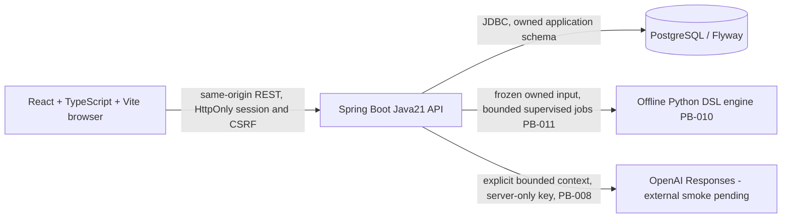

# Prototype architecture and CNPM physical view

Status: PB-001–PB-007 and PB-010 delivered. PB-008 provider boundary implemented
and locally tested, disabled by default; real-provider smoke remains blocked on
credentials. PB-011 now implements owned API jobs; final verification is in
progress. Web job controls/result visualization remain PB-012.

PB-004 adds owner-scoped conversation/message APIs and additive FlywayV3. JDBC
transactions lock current user then owned conversation for quota/idempotency/version
checks. React chat state lives below the authenticated identity root, above the
responsive renderers; delayed responses cannot mix contexts. Detailed sequence,
class and ERD views are in specs/PB-004/design.md. No new infrastructure/dependency.

The frontend auth, conversations, strategy editor and market chart call the real
API; remaining backtest sample panes are explicitly demos. All future private API paths deny
access until their authenticated feature is implemented. No browser→DB/Python/provider-key shortcut is allowed.
Native PostgreSQL tests use a fresh project-owned cluster, not the user service.
Local developer compose, if used, binds DB port to loopback and needs an environment
password; it never defaults to trust authentication or a hardcoded credential.

```mermaid
flowchart TB
  Researcher((Researcher)) --> Shell([Inspect demo trading workspace])
  Researcher --> Register([Register local account])
  Researcher --> Login([Sign in / out])
  Researcher --> Account([Update own name / password])
  Researcher --> Chat([Manage private conversations and messages])
  Researcher --> DSL([Validate neutral Strategy DSL draft])
  Researcher --> Market([Import and inspect private OHLCV datasets])
  Researcher --> DeleteMarket([Delete own dataset with confirmation])
  Researcher --> Strategy([Edit and save own draft or validated strategy revisions])
  Researcher --> History([Inspect immutable history and restore as new revision])
  Researcher --> AI([Explicitly ask configured AI; inspect/cancel owned attempt])
  Researcher --> Job([Submit owned revision/dataset job; inspect/cancel/retry API result])
  Operator((Developer/operator)) --> Start([Start local API and isolated DB tests])
  Operator --> Ready([Inspect minimal readiness])
  Operator --> Offline([Run bounded offline DSL backtest with synthetic or owned data])
```

This is the currently supported use-case diagram. Add authenticated research,
chat/strategy/backtest/journal/knowledge use cases only as their PB items are built.
Per-feature sequence/class diagrams are in specs/PB-001 and specs/PB-002.

Flyway owns trading.flyway_schema_history
(installed_rank PK, version, description, type, script, checksum, installed_by,
installed_on, execution_time, success). PB-003 V2 creates app_user, spring_session,
spring_session_attributes and auth_rate_bucket; its implemented ERD/class/sequence
diagrams are in specs/PB-003/design.md. Later
features own their additive migrations and ownership foreign keys. Never invent a
completed overall ERD from planned tables. PB-026 reconciles this file with code.

PB-005 adds stateless DslController → DslValidator → bundled DslSchema. All routes
are session protected; POST is CSRF protected and bounded64KiB (other writes16KiB).
Typed DAG/units/risk/complexity validation precedes deterministic canonical/hash
creation; no interpreter/provider/target engine executes this data. No new ERD
entity in PB-005 itself: PB-007 owns immutable persisted strategy versions. PB-004's V3
conversation/message entities and owner constraints remain as documented in its
design; delivered cc99d4d / Issue7 completed. PB-005 delivered28a68e0 / Issue8 completed.

PB-006 adds MarketController → MarketService → MarketCsvParser and immutable
market_dataset/market_candle tables through V4. Owner locks serialize quota,
idempotency and deletion; owner predicates protect metadata and candle reads.
Repeatable-read candle paging keeps metadata and rows coherent during deletion.
Only POST /api/datasets/import accepts2MiB JSON; existing limits remain unchanged.
Native React/SVG converts decimal strings only for geometry and retains exact
values for inspection. No provider, runtime interpreter or new dependency added.
Detailed sequence/class/ERD and data contract: specs/PB-006/design.md.

PB-007 adds StrategyController → StrategyService → DslValidator and V5 strategy /
strategy_revision. Only strategy current pointer advances; saved revision rows stay
immutable. Owner/credential locks protect quota/idempotency and optimistic revision
checks. DRAFT text is bounded inert data; VALIDATED rows contain server-derived
canonical DSL/hash/schema/validator/minimumBars. Every current/history read is owned.
StrategyProvider lives under keyed identity and keeps editor state across responsive
renderers; no browser storage. Native JSON editor and real DatasetChart share a
workspace but no database binding; future jobs explicitly select version+dataset.
No provider/runtime/export/dependency change. Full diagrams: specs/PB-007/design.md.

PB-010 adds a fixed isolated Python launcher → strict contract validator → causal
IndicatorEvaluator → execution/accounting/result. It reads one bounded JSON request
from stdin and returns deterministic JSON on stdout; no network, DB, user path,
eval or dynamic plugin. Existing bundled DSL schema is shared read-only, with an
independent Python semantic check and matching Java canonical/data hash fixtures.
No migration or UI change. The API capabilities reports offline_engine_implemented
for Python while operation remains validation_only. PB-011 must enforce owned
snapshot selection, supervisor timeouts/cancellation and durable results before
connecting the API to this worker. Details: specs/PB-010/design.md, python/README.md.

PB-008 adds AiController → AiService → AiTurnStore / OpenAiProvider and additive
V6 ai_turn. Current-user/owned-conversation transactions reserve bounded context
and finalize only against unchanged versions; provider HTTP runs outside the DB
transaction. Closed structured output is validated before an atomic assistant
append. Durable request identity, lease, cancellation and fixed error codes prevent
hidden replay or fake success. The explicit React controls share existing keyed
conversation state. Fixed HTTPS endpoint/no redirects/no tools; body and whole
request bounds; server secrets never returned. See specs/PB-008/design.md for
sequence/class/ERD. Local stub evidence does not certify actual provider access.

PB-011 adds BacktestController/Store/Scheduler/PythonWorker/BacktestJson and V7.
Owned validated strategy revision and dataset are frozen into a bounded canonical
input before queue admission. Worker arguments/entrypoint are fixed; sanitized
environment, OS resource limits and bounded pipe/wall supervision protect the
trusted engine. Global DB admission/claim limits and current-owner credentials
protect lifecycle transitions. Source IDs are provenance, not source-cascade FKs;
account deletion cascades jobs, while explicit terminal job deletion removes
snapshots/results. Full sequence/class/ERD: specs/PB-011/design.md. Python semantics
remain PB-010; web charts/controls are PB-012, notifications PB-022.

PB-012 adds BacktestProvider inside the authenticated identity-keyed subtree.
Explicit saved-input submission and owned job selection drive ResultView,
EquityChart, TradeList and reused CandleChart. Per-operation epochs invalidate late
job/result/chart replies; uncertain mutations retain their original UUID, including
when a retry itself is rejected. No implicit engine invocation or browser storage.
BacktestStore reads bounded candle windows from V7 input_json only after current
credential/owner/state checks. Source deletion does not change these bars. No new
ERD entity/migration/dependency or Python accounting change. Sequence/class/UI and
threat/test contracts: specs/PB-012/design.md and test-cases.md.
