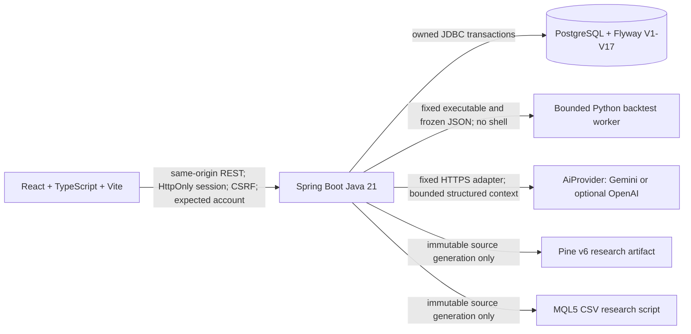
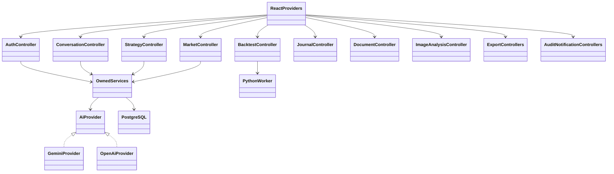
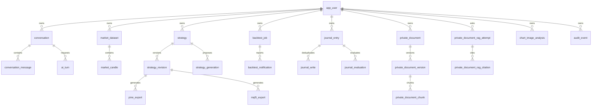

# Prototype architecture and CNPM aggregate views

Status: PB-001–PB-019, PB-022–PB-025 and PB-027 are DONE. PB-020 broker/
paper-order integration and PB-021 external market connector are optional and
deferred. PB-026 reconciles this aggregate view. Feature-level semantics and
evidence remain authoritative in `specs/PB-*`; this document does not claim
production readiness, live trading or guaranteed results.

## Physical / system view

Provider access is disabled by default and keys remain server-only environment
configuration. Pine/MQL exports derive from the same validated method-neutral DSL;
they contain no live orders, network/DLL access or broker account integration.
Official PB-015/PB-016 synthetic target evidence and PB-017 event consistency are
complete; those checks are not runtime services in this architecture.

## Overall Use Case Diagram

```mermaid
flowchart TB
  R((Researcher)) --> Auth[Register, sign in/out, manage own account]
  R --> Chat[Manage private chat and explicit AI turns]
  R --> Market[Import/inspect/delete owned OHLCV CSV]
  R --> DSL[Validate method-neutral Strategy DSL]
  R --> Strategy[Save immutable strategy revisions]
  R --> Generate[Request and explicitly accept/reject AI DSL proposal]
  R --> Backtest[Run/cancel/retry owned Python backtest]
  R --> Results[Inspect frozen chart, trades and exact metrics]
  R --> Journal[Manage journal and exact period P&L]
  R --> Evaluate[Request grounded journal evaluation]
  R --> Export[Generate private Pine/MQL research artifacts]
  R --> Documents[Version private TXT/PDF and request cited RAG]
  R --> Images[Analyze private bounded chart image]
  R --> Notices[Read backtest terminal notifications]
  R --> Audit[Inspect private bounded activity metadata]
  O((Developer/operator)) --> Setup[Configure/start fixed local stack]
  O --> Verify[Run isolated tests, audits and readiness verification]
  O --> Optional[Evaluate deferred broker/data connector separately]
```

Every private use case enforces authenticated ownership and expected-account
binding in addition to CSRF on unsafe methods. Resource identifiers never grant
authority. AI/provider output remains inert structured research data and cannot
execute code, mutate accepted DSL without confirmation, or place an order.

## Overall class / component view

Controllers accept bounded contracts. Services/stores lock the current user and
owned aggregate, enforce quota/idempotency/version checks, and persist through
JDBC. `BacktestStore` freezes provenance/input before `PythonWorker` starts a fixed
trusted entrypoint with sanitized environment, time/memory/output limits. AI
services reserve durable attempts before calling the selected provider outside a
database transaction, then validate and atomically finalize against unchanged
context. React providers are keyed by authenticated identity and discard stale
responses on account/resource changes.

## Aggregate ERD and migration ledger

Flyway is append-only. V1 creates schema/history context; V2 adds identity,
sessions and auth rates; V3 conversations; V4 market data; V5 strategies; V6 AI
turns; V7 jobs; V8 journal; V9 Pine; V10 MQL5; V11 audit; V12 notifications; V13
provider-neutral constraint; V14 generation; V15 journal evaluation; V16 private
documents/RAG; V17 chart image analysis; V18 conversation chart attachments. Exact names and SHA-256 are pinned in
`docs/readiness-migrations.json` and checked by the offline readiness verifier.

Complete SQL table inventory: `app_user`, `spring_session`,
`spring_session_attributes`, `auth_rate_bucket`, `conversation`,
`conversation_message`, `market_dataset`, `market_candle`, `strategy`,
`strategy_revision`, `ai_turn`, `backtest_job`, `journal_entry`, `journal_write`,
`pine_export`, `mql5_export`, `audit_event`, `backtest_notification`,
`strategy_generation`, `journal_evaluation`, `private_document`,
`private_document_version`, `private_document_chunk`,
`private_document_rag_attempt`, `private_document_rag_citation`, and
`chart_image_analysis`.

Owner roots generally reference `app_user` with delete cascade. Child records
cascade from their aggregate root. Backtest source identifiers are retained as
snapshot provenance so source deletion does not erase results. Journal dataset
identity is provenance rather than authorization. Detailed keys, constraints,
rates, lifecycle and precision rules stay in the corresponding migration and
feature design; this aggregate ERD intentionally omits columns.

## Trust and deployment limits

The prototype is a local research platform. PostgreSQL test clusters are created
under owned `tmp/pg-test-*`, bound to loopback, and removed from service after
tests; generated credential files are deleted. Production-like deployment,
multi-node scheduler coordination, backup/restore operations, broker connectivity,
external data licensing, live orders, payment and compliance certification are
outside the implemented scope. Historical returns and AI analysis never guarantee
future performance.
