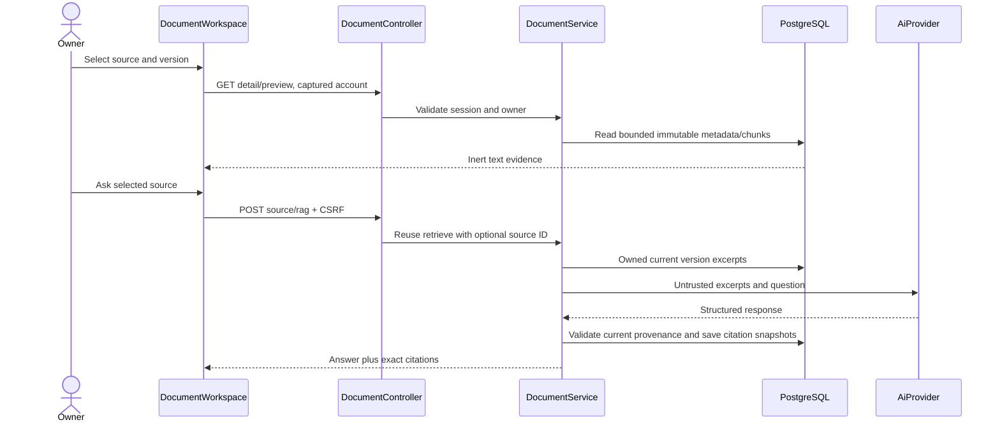
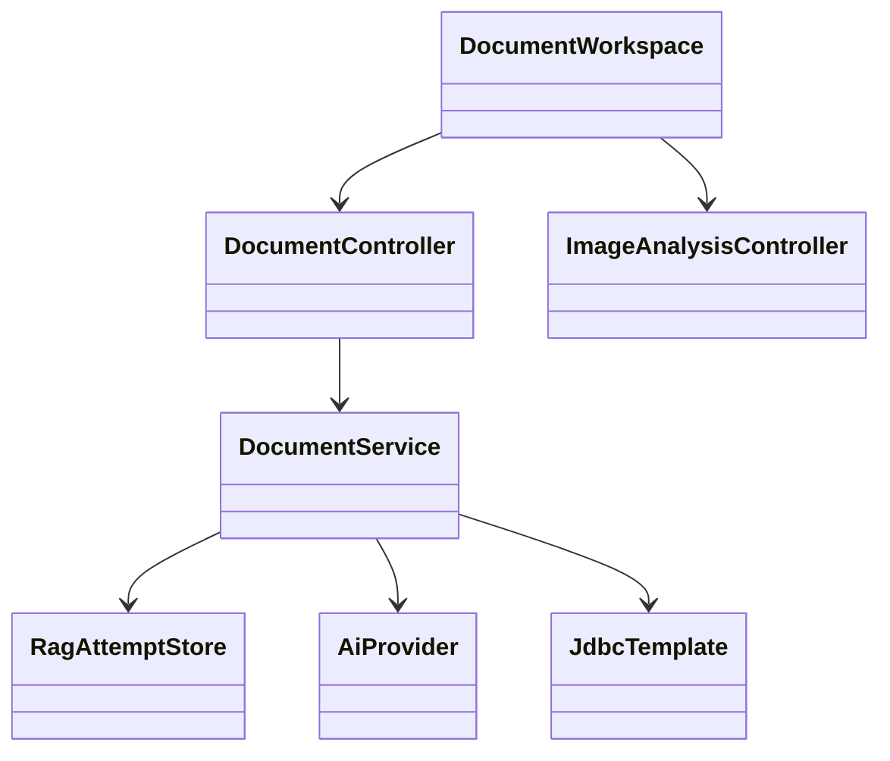

# Library design — Refs #42

## Components and API
DocumentWorkspace owns catalog/selection/search/upload intent through LibraryWorkspace; account-keyed child discards previous identity state. Library detail uses bounded APIs. Native dialog with explicit first/last Tab wrap provides modal focus containment, Escape and restoration; tablet detail is a modal drawer, desktop inline. An unresolved upload installs beforeunload protection; closing its dialog retains the exact in-memory file/request for retry. Existing Image Analysis domain stays independent. Existing privateRequest guards every request with captured account.

GET /api/documents/catalog returns document plus current version metadata. GET /api/documents/{id} returns document and all bounded immutable version metadata. GET /api/documents/{id}/versions/{version}/preview returns bounded chunks. POST /api/documents/{id}/rag adds source restriction to existing retrieval; global /rag stays compatible. AuthGuard treats both as AI start requests. No changes to upload/delete contract.

## Data/ERD impact
NONE: reuse private_document, private_document_version, private_document_chunk and existing RAG snapshots. Applied V16 unchanged. Preview excludes source bytes; no file path/HTML execution. Existing owner user-row locking order preserved. Delete cascades document versions/chunks while historical citation snapshots remain by existing design. No new dependencies.

## Verification
Existing upload/RAG/security integration suite plus new metadata/preview/selected-source tests; UI navigation/retry/deletion/selection/security tests and real browser with disposable PostgreSQL/synthetic identity. Full frontend checks and wrapper backend build, dependency audit and CI.
