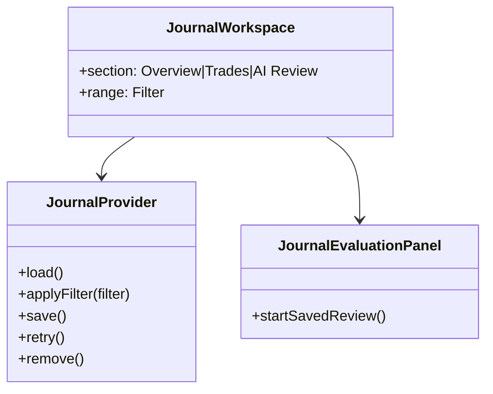
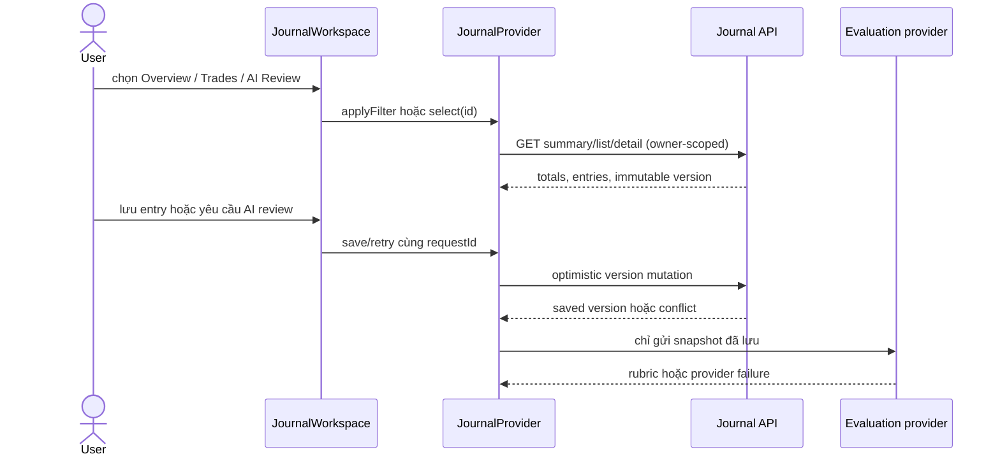

# Thiết kế Journal

## Component/class view

## Sequence

## Data/ERD impact

Không thêm bảng. Luồng dùng `trading.journal_entry`, các version/request hash và `trading.journal_evaluation` hiện có; report tính realized values theo `exit_time` của bản CLOSED trong timezone được kiểm tra.

## Security

Owner id được lấy từ authenticated principal; UI không render HTML từ reason/notes. Request retry giữ nguyên body hash và expected version để ngăn duplicate/replay. AI failure được trả về như trạng thái unavailable, không sinh review giả.
