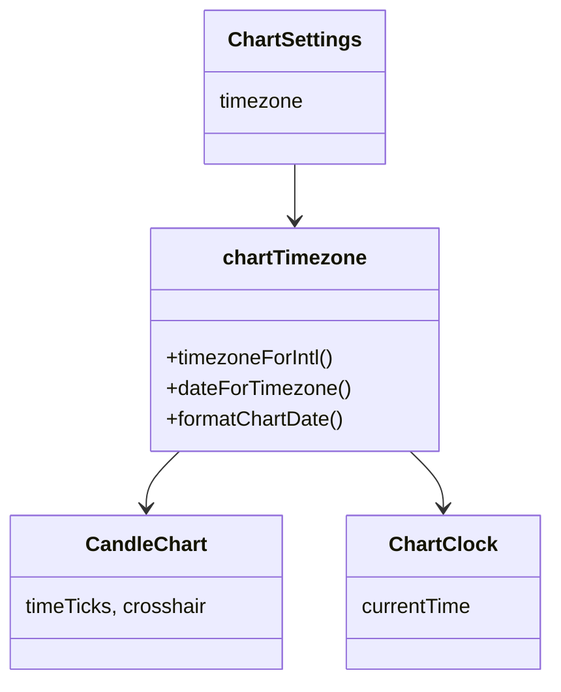

# Thiết kế timezone

```mermaid
classDiagram
  class ChartSettings { timezone }
  class chartTimezone {
    +timezoneForIntl()
    +dateForTimezone()
    +formatChartDate()
  }
  class CandleChart { timeTicks, crosshair }
  class ChartClock { currentTime }
  ChartSettings --> chartTimezone
  chartTimezone --> CandleChart
  chartTimezone --> ChartClock
```

Mọi điểm định dạng thời gian gọi `formatChartDate`; fixed offset được dịch sang một Date UTC trước khi Intl format, còn IANA đi qua `Intl.DateTimeFormat` để giữ DST.
