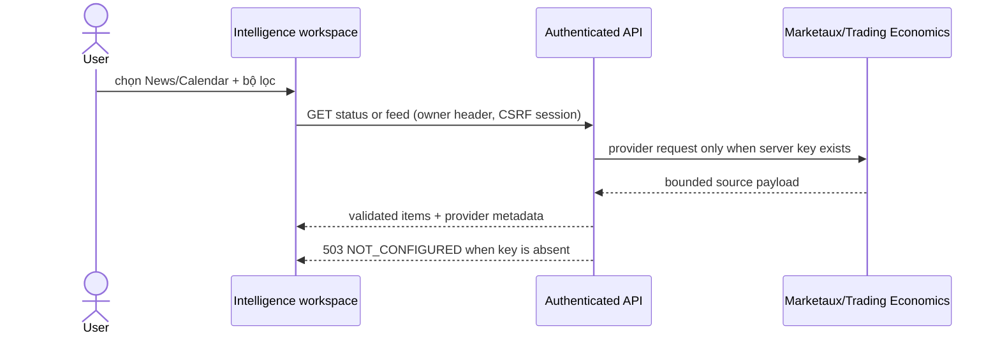
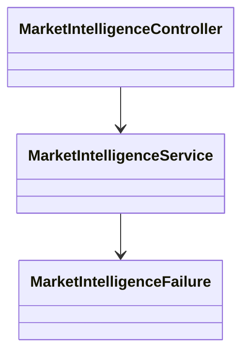

# Delivery D — Market Intelligence

## Mục tiêu

Thêm workspace Market Intelligence gồm Market News và Economic Calendar, với ranh giới provider rõ ràng và trạng thái unavailable trung thực khi chưa có credential.

## Provider audit

- Marketaux có endpoint `GET /v1/news/all`, yêu cầu `api_token`; response ngày UTC và có phân trang. Nguồn chính thức: <https://www.marketaux.com/documentation>.
- Trading Economics cung cấp calendar API/streaming, yêu cầu API key/client credentials. Nguồn chính thức: <https://docs.tradingeconomics.com/get_started/> và <https://docs.tradingeconomics.com/economic_calendar/schema/>.
- Frankfurter/ECB chỉ là exchange-rate reference, không được dùng để dựng headline hoặc event giả: <https://frankfurter.dev/providers/ecb/>.

## Use case / acceptance criteria

**UC-D1 — Kiểm tra thông tin thị trường.** Người dùng mở Market Intelligence, chọn News hoặc Calendar, nhập query/date range/timezone và tải dữ liệu. UI hiển thị provider/status/source metadata; khi key trống, UI hiển thị unavailable và không tạo dữ liệu.

- Backend có `/api/market-intelligence/status`, `/news`, `/calendar`, authenticated + rate limited.
- Query tối đa 80 ký tự; calendar tối đa 32 ngày; timezone phải là ZoneId hợp lệ.
- Provider keys chỉ đọc từ environment (`MARKET_NEWS_API_KEY`, `MARKET_CALENDAR_API_KEY`), không gửi xuống frontend/log.
- Không scrape Investing.com/Forex Factory và không chạy code từ payload provider.

## Sequence / class / ERD

Không đổi ERD ở prototype; các feed chưa được lưu và không ảnh hưởng backtest/journal.

## Definition of Done

UI, authenticated API boundary, provider audit, validation tests, security/rate-limit path and honest unavailable evidence are complete. Live provider data remains pending credential and adapter implementation.
