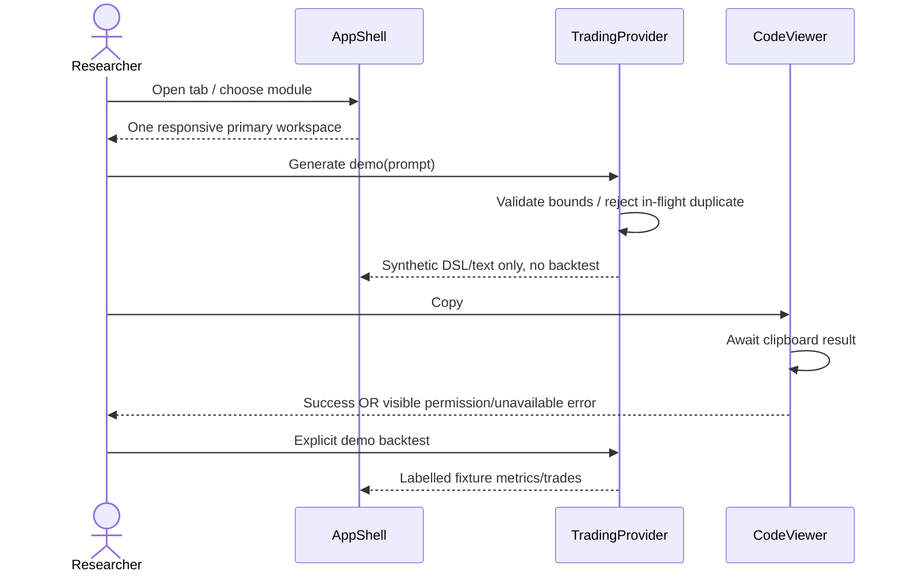
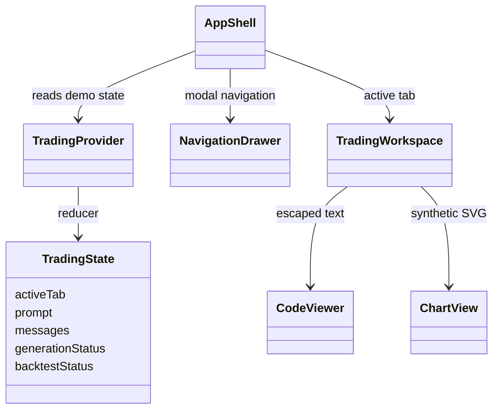

# PB-001 design — Refs #4

Reuse the existing React Context/reducer and responsive components from 0029c82.
Keep all original 10 tests unchanged. No UI framework/state/chart package added.
Retain Tailwind; neutralize theme tokens and remove decorative spark icons.
Central brand config avoids a scattered replacement later. Old SVG chart and
exports remain labelled demo-only; they are not validated production DSL/targets.

Navigation dispatch maps every destination to a real workspace or honest planned
module view. A native modal dialog provides focus containment/inert background;
Escape closes and restores trigger focus. Tabs use roving focus and arrows/Home/End.
The resize divider remains bounded 320–400 px and keyboard-operable.

Clipboard errors are caught and shown, success is set only after writeText resolves.
Prompt validation trims 1–4000 characters, duplicate in-flight calls are guarded
with refs (not only disabled buttons); timers clear on provider unmount. Disable
editing during generation to prevent a pending result erasing newly entered text.

Data/ERD: N/A, no database. No server authorization claims. Later PB-003/004
replace local demo context with authenticated persistent data. Recovery: revert
through a new compensating commit; original branch and files remain available.

Security applicability: XSS/plain-text handling, clipboard failure, input/memory
bounds, repeat events, dependency supply chain. Backend-only threats explicitly
outside this feature; PB-003 onward must enforce them at server boundaries.
