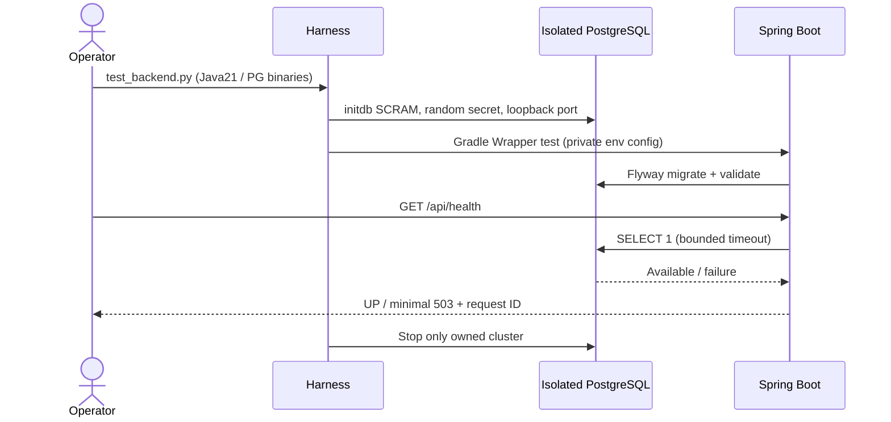
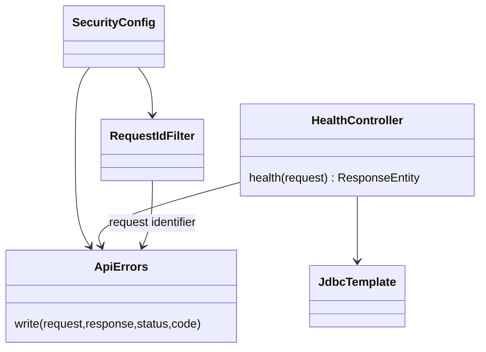

# PB-002 design — Refs #5

Spring Boot 4.1.1 stable is compatible with Java21 and Gradle9.7.1. Initializr
metadata incorrectly advertised .RELEASE suffix; the generation failed until the
documented 4.1.1 coordinate was used. No downgrade or stack change. Gradle jar
SHA verified against services.gradle.org; distribution SHA pinned before execution.

Use Spring JDBC for explicit parameterized ownership queries in future features;
no ORM/new service/broker infrastructure needed. Spring Security default-denies all
paths except GET /api/health. Disable only generated login/basic/logout endpoints,
not CSRF. An empty user lookup prevents a generated default password; PB-003 owns
real user authentication. Responses use static error codes and server-generated
request IDs, never echoed hostile request headers or exception messages.

Health executes SELECT 1 with connection/query timeouts and catches database
failures into a minimal 503. Flyway creates/validates the trading schema, with an
initial migration documenting that boundary. No user/financial tables invented.

Test architecture: the Windows Docker daemon is not running but PostgreSQL17
native binaries are installed. A project-owned Python test harness uses initdb
under tmp/, a generated SCRAM password and loopback random port. It starts only its
own cluster, supplies credentials only via child environment, executes Gradle
Wrapper tests, stops that cluster in finally, and never connects to/reconfigures
the existing postgresql-x64-17 service. CI uses the same harness with PostgreSQL
binaries available on the runner. Test results include real HTTP and SQL, not H2.

ERD impact: trading.flyway_schema_history is framework-owned migration metadata;
no business ERD yet. Future migrations are additive; never clean/reset applied
schema. Runtime role and migration role separation is considered in PB-023; local
prototype role is limited to its project DB, no production credentials are read.

References: https://docs.spring.io/spring-boot/system-requirements.html;
https://docs.gradle.org/current/userguide/gradle_wrapper.html;
https://docs.spring.io/spring-security/reference/servlet/exploits/csrf.html.
