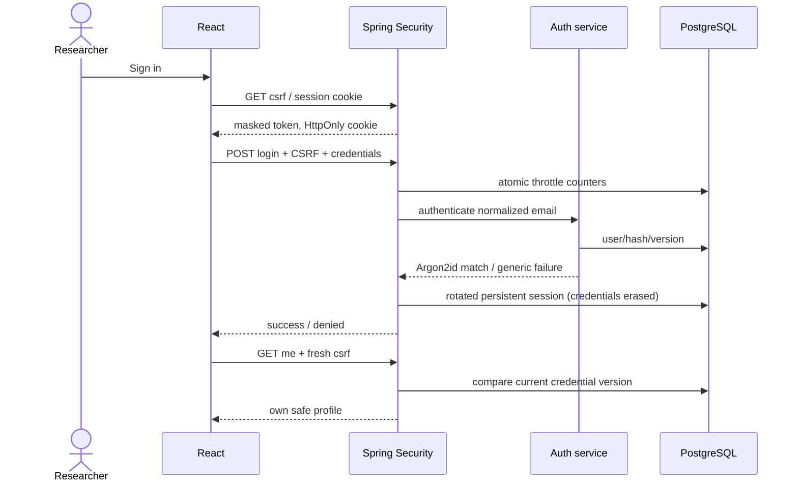
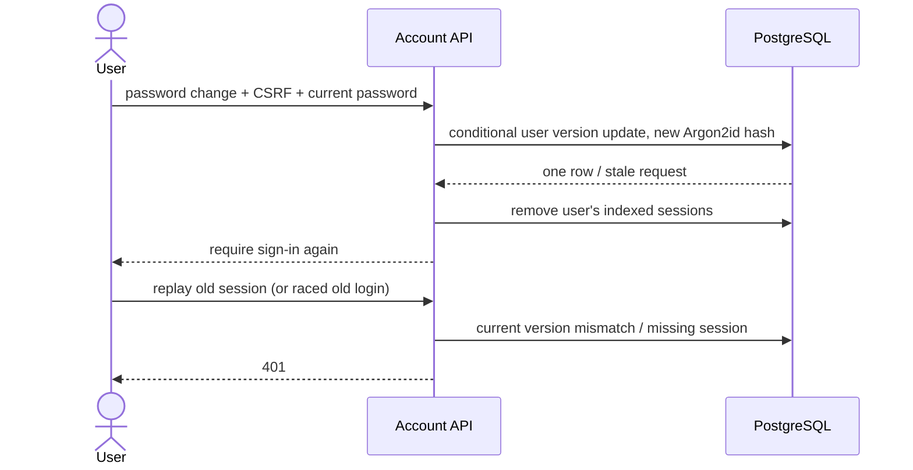
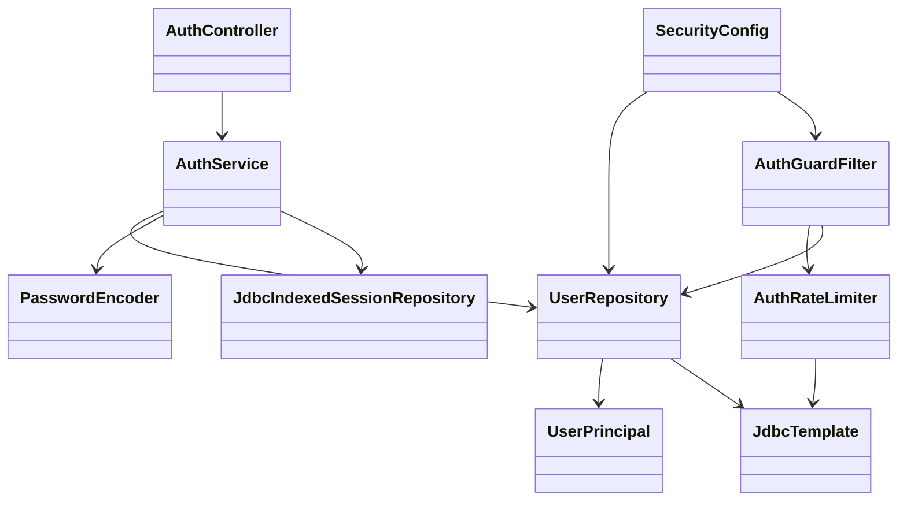
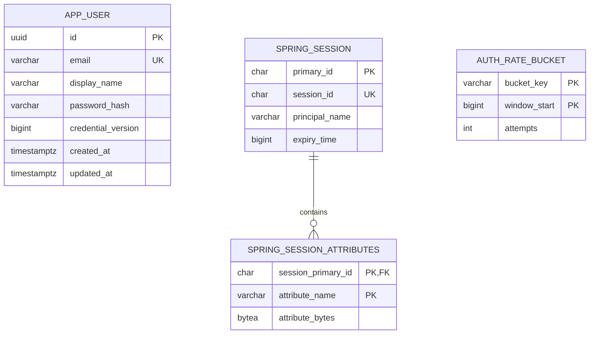

# PB-003 authentication design — Refs #6

Use Spring Security's maintained form authentication processing filter (POST
form-encoded email/password, JSON success/failure handlers), not handwritten
credential/session cryptography. React obtains a masked CSRF token from a public
GET endpoint, retains it in memory only and refreshes it after authentication.
Every unsafe endpoint remains CSRF protected, including registration and logout.
The public UI runs through Vite's same-origin /api proxy on loopback in development.
No permissive CORS. For cross-machine deployment require HTTPS/Secure cookies.

Spring Session JDBC 4.1.1 (Boot starter/BOM) uses PostgreSQL already
required by the stack; it supplies persistent sessions without Redis. Flyway owns
its schema; framework auto-initialize is disabled. Session attributes are solely
server-generated CSRF/security context. Browser input never becomes a serialized
object or class name. Database write access is a trusted boundary; protect DB
credentials and do not expose session tables. Spring Security erases credentials
before persistence. Test absence of raw password/hash in stored session attributes.

License provenance: Session core/JDBC POM metadata says "Broadcom Foundation
License" without a URL; do not silently relabel that metadata. Both actual4.1.1
JARs contain Apache2.0 in META-INF/LICENSE.txt, and the exact upstream4.1.1 tag's
LICENSE.txt also contains Apache2.0 (Git blob62589edd12a37dd28b6b6fed1e2d728ac9f05c8d).
Keep these packaged notices and the discrepancy in test-evidence/
session-license-provenance.json. The delivered artifact and tagged source support
continuing this prototype under their included Apache terms; no commercial service
or paid support is enabled. Recheck licensing when upgrading or redistributing.

Argon2PasswordEncoder uses Bouncy Castle bcprov-jdk18on 1.85.2 (official current
release metadata, Bouncy Castle MIT-based licence); Java21-compatible JDK18on means
Java 1.8+, not a Java18 minimum. Explicit Argon2id: salt16 bytes, hash32 bytes,
parallelism1, memory19456 KiB, iterations2. Verify encoded parameters and distinct
salts, and re-run dependency audit after resolution. No bespoke crypto.

User IDs are UUIDs. Email is lowercased/trimmed with Locale.ROOT, bounded ASCII
login identifier; no mailbox-verification claim. Password is never trimmed or
truncated. Display name trims outer whitespace and rejects controls, 1–80 chars.
Only profile fields are returned; no hash/version in public response. Unknown JSON
fields fail validation, so owner/id/roles cannot be mass-assigned. Email changes,
admin roles, password recovery and mail verification are intentionally not in this
feature. Same 202 registration acknowledgement for new/existing email; always do
bounded hashing work so duplicate handling does not skip the expensive step.

Principal contains user UUID and credential version. Every authenticated request
checks the current DB version; revocation therefore covers sessions created by a
concurrent login that read an old password before a password-change transaction.
Password change conditionally updates WHERE id AND version, then invalidates all
indexed sessions. Profile mutations use the same version predicate. Concurrent
password changes cannot both overwrite the password from the same credential state.

Rate limiting is a PostgreSQL atomic counter per fixed 15-minute window: register
10/IP, login30/IP plus10/account, password-change10/user, csrf120/IP to bound
anonymous session creation. Count attempts including
successes to avoid timing/state enumeration; return generic429 + Retry-After.
Use actual remote address, not attacker-supplied forwarding headers. SHA-256 is
used only for bucket identifiers, never password storage. Expired buckets are
pruned; IP cap bounds account-bucket creation. Valid CSRF is checked before the
expensive authentication path. JSON/form body limited to16 KiB; password/field
bounds protect hashing. Database failures fail closed with minimal503, not bypass.

Principal-name indexing associates authenticated sessions with users; anonymous
CSRF sessions have no user and no invented FK. Schema/index sizing follows the
framework contract, including email length254 for principal-name storage.

References: [Spring Session JDBC](https://docs.spring.io/spring-session/reference/configuration/jdbc.html),
[form authentication](https://docs.spring.io/spring-security/reference/servlet/authentication/passwords/form.html),
[OWASP password guidance](https://cheatsheetseries.owasp.org/cheatsheets/Password_Storage_Cheat_Sheet.html),
[Bouncy Castle licence](https://www.bouncycastle.org/licence.html).
