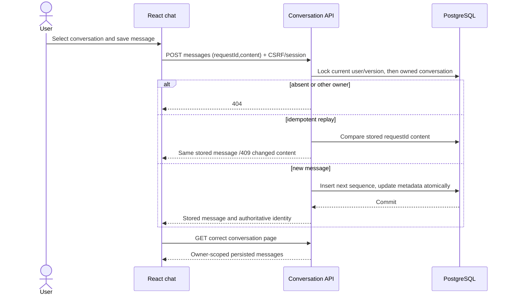
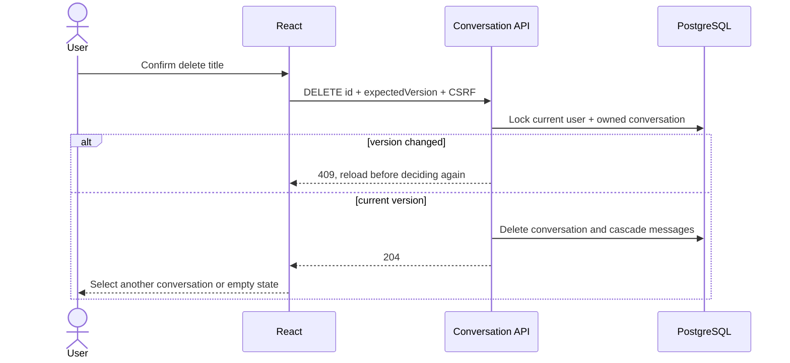
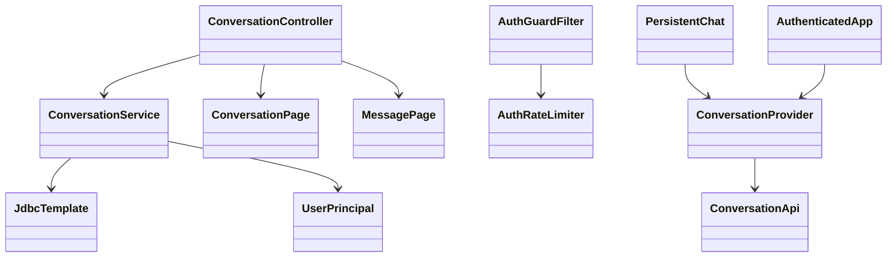
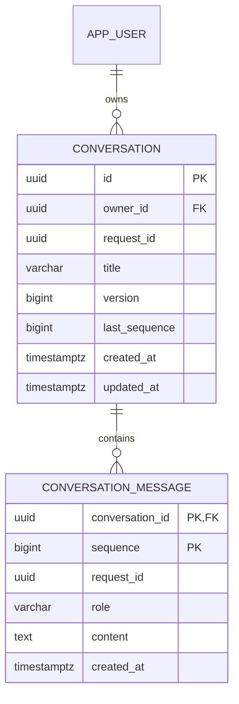

# PB-004 — Conversation persistence design

No additional dependencies. Spring MVC/Security, JdbcTemplate and PostgreSQL
transactions remain the authoritative boundary. React replaces the authenticated
chat surface; inherited mock component remains available only for standalone
demo/regression rendering outside the real auth root. No invented AI response.

## API contract

Base /api/conversations; every route requires a current authenticated session.

| Method/path | Request | Result |
| --- | --- | --- |
| POST base | requestId UUID |200 conversation, including idempotent retry |
| GET base | limit1–50 default20, optional cursor | items, nextCursor; owner-only, created_at DESC/id DESC |
| GET /{id} | canonical UUID | conversation metadata;404 absent/other user |
| PATCH /{id} | title, expectedVersion positive integer | updated metadata;409 stale |
| DELETE /{id} | expectedVersion positive integer JSON |204;404 absent/other user;409 stale |
| GET /{id}/messages | limit1–100 default50, optional before positive sequence | items ordered ascending; nextBefore for older page; conversation metadata |
| POST /{id}/messages | requestId UUID, content1–4000 |200 stored message;409 same key/different content or quota |

Conversation DTO: id,title,version,createdAt,updatedAt,lastMessage (preview up to160
characters, empty for no message). Message DTO: sequence,requestId,role,content,
createdAt. All timestamps use ISO8601 UTC from database OffsetDateTime/Instant.
No user email/password/owner field is returned. Server owns IDs/time/role/sequence.
Cursor encodes createdAt + UUID in bounded URL-safe Base64; malformed input400.
It is not signed because it confers no authorization; every query still scopes
owner. Created-time sorting avoids pagination skips under rename/new messages;
refresh shows new conversations. Message pages select seq<before in descending
order LIMIT+1 then reverse the displayed page. Appends never shift earlier pages.

## Writes, replay and concurrency

Transactions first SELECT app_user WHERE id AND credential_version FOR UPDATE,
then SELECT conversation WHERE id AND owner_id FOR UPDATE. Uniform lock order
avoids deadlock between this feature's writes. The user lock serializes per-user
quota creation and makes revoked credentials fail at the mutation boundary.
No child update without owner predicate/locked parent. JDBC placeholders only.
The global AuthGuard continues checking credential version for all API requests.

Creation caps100 active conversations per user and uses unique(owner_id,request_id).
A duplicate existing requestId returns that row before quota rejection; deleted
resource recreation by replay is not guaranteed (documented, UI does not retry a
create after deleting its successful resource). All creates initially use a
server-default title, so there is no user payload mismatch to compare.
Append checks existing(conversation,requestId) before quota2000 and compares
normalized content exactly. New message gets last_sequence+1; update parent
sequence/version/time in the same transaction. A rename/delete expectedVersion
protects against unseen concurrent append/rename. Deleting cascades its messages.
Every mutation is limited120/user/15min through existing atomic rate buckets;
successful and replay attempts both count. Quotas are prototype safety limits,
not credit/payment. Reads/page/body bounds avoid unbounded resource consumption.

## Client state and honest UX

Conversation state lives above responsive chat renderers and below authenticated
user root. User identity change/unmount discards private state; no localStorage.
Async list/message responses have generation guards; switching conversation clears
visible messages immediately. Request failures never populate another context.
Explicit load-more/earlier controls; deduplicate IDs/sequence when pages merge.

Composer sends no role or owner. Keep a stable requestId and exact text while a
save outcome is uncertain; show Retry save instead of generating a new key or
silently appending local success. Editing during a pending/uncertain write is
disabled until resolved, while the draft remains visible. List selection/create/
delete/rename is disabled while an uncertain write must be resolved, avoiding
accidental context changes; read errors offer retry without private-data fallback.
New Chat creation similarly keeps its requestId until confirmed. Refresh after
successful mutations retrieves authoritative metadata. Deletion requires Modal
confirmation, and failure leaves the conversation intact in UI. Text is React text
content, never rendered Markdown/HTML in this feature. Provider integration follows
in PB-008; these are saved user messages, not claimed AI outputs.

## Diagrams

V3 is additive. Flyway validates V1/V2 untouched; no down/reset migrations or user
DB changes. Recovery uses retry-safe reads/idempotent writes and normal backup
practice; intentional conversation deletion is permanent in prototype and UI says
so. Audit/operational events expand separately in PB-024; no prompt-content logs.
