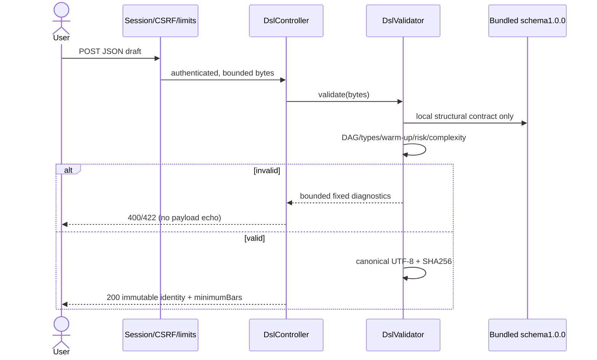
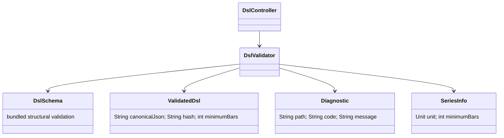

# PB-005 design — 31/08/2026

Issue #8; AC-DSL-01–07. No new dependency, migration, UI, generator or engine.
The existing Jackson/JDK stack parses data; no interpreter runs submitted code.

## Interfaces and trust boundary

GET `/api/dsl/schema` returns bundled schema1.0.0; GET `/api/dsl/capabilities`
returns the version/limits and **validation only**, with Python/Pine/MQL5 runtimes
not yet implemented. POST `/api/dsl/validate` takes the document directly, returns
200 immutable canonicalJson/hash/schemaVersion/validatorVersion/minimumBars, or
422 `{valid:false,errors:[{path,code,message}]}`. At most20 errors; fixed messages,
known schema field paths/indexes only, never echo unknown keys or values.
Malformed JSON400; body >65536 bytes413 (including chunked); CSRF403,
anonymous401, per-user120 requests/15min429; unavailable auth DB503.
Only this exact POST receives the64KiB allowance; other unsafe routes keep16KiB.
All DSL endpoints require a current authenticated session. No owner resource ID
exists yet; validation is stateless, never reads another user's strategy/context.

Data/ERD: no tables/migration. PB-007 later persists owned immutable strategy
versions containing this identity. No session JSON or log payload persistence.
UI N/A; PB-007 supplies editor, current mock DSL is not accepted.

## Closed v1 grammar and resource bounds

All objects reject additional properties. Root fields all explicit: schemaVersion,
name, labels, market, indicators, rules, risk, execution. Labels are bounded inert
text, not algorithm selection. One symbol (ASCII letters/digits/dot/underscore/hyphen,
1–32, starting alphanumeric), one of1m/5m/15m/30m/1h/4h/1d, UTC.
Name1–120 Unicode codepoints; labels0–10 of1–40 codepoints. No controls or unpaired
surrogates. No automatic trim/case/Unicode normalization: names are identity data.

Operand: `series(field:open|high|low|close|volume,lag:0..2000)`,
`constant(value:-1e12..1e12,multipleOf:1e-8)` or
`indicator(id,lag:0..2000)`. IDs ASCII `[a-z][a-z0-9_]{0,31}`.
Up to32 indicator definitions; refs may point forward but form an acyclic graph.
SMA/EMA/RSI/HIGHEST/LOWEST use source operand (not constant), period2..2000;
ATR period2..2000; PIVOT_HIGH/PIVOT_LOW left/right1..100;
TRENDLINE references a PIVOT_HIGH or PIVOT_LOW ID.

Conditions: compare(op:gt|gte|lt|lte|eq|neq,left,right),
cross(direction:above|below,left,right), all/any(children2..8), not(child).
Max128 conditions total and8 nested condition levels across four rules.
LongEntry/shortEntry/longExit/shortExit are condition or explicit null. At least
one entry; exit for a disabled side is invalid. Null exit means protective SL/TP
only, never an implicit opposite-side exit. Price vs volume vs oscillator units
cannot be compared, except numeric constants adopt their counterpart's unit.
Two constants are rejected (not a measurable bar condition).

Whole tree max2048 JSON values, JSON depth24, number lexeme64, decimal scale8,
absolute magnitude1e12, strings4096 at parser boundary (tighter schema fields).
minimumBars cannot exceed10000. Parser rejects duplicate keys/trailing JSON,
nonfinite numbers/coercions; diagnostics terminate before semantic processing on
structurally invalid input. Input never supplies schema refs or regexes.

The bundled file uses JSON Schema2020-12 type/const/enum/properties/required/
additionalProperties/items/minItems/maxItems/minLength/maxLength/pattern/
minimum/maximum/multipleOf/oneOf/internal $ref. A deliberately limited checker
implements only this trusted subset, not a general JSON Schema service. Startup
rejects unsupported schema keywords, nonlocal refs and unsafe schema changes.
Semantic limits are additional requirements: schema-valid alone is not executable.
Reference: [official validation vocabulary](https://json-schema.org/draft/2020-12/json-schema-validation).

## Indicator registry semantics for later runtimes

Bars indexed0..n-1 at UTC open time; OHLCV is available only at close. Lag k at
t means value at t-k; never forward-fill an undefined indicator. Comparison with
an undefined operand is false; `not` of undefined remains undefined/false at rule
boundary (three-valued logic). all: false dominates, else undefined dominates;
any: true dominates, else undefined dominates. This avoids not(warm-up) signals.
Cross above: left[t]>right[t] and left[t-1]<=right[t-1]; below symmetric.

SMA full window; EMA seeded with first period SMA then alpha2/(p+1). RSI Wilder
seed uses period consecutive price changes then alpha1/p; gains/losses bothzero
=>50, losszero only=>100, gainzero only=>0. ATR true range starts at bar1 using
previous close, Wilder seed period observations then alpha1/p.
HIGHEST/LOWEST use full source window. Smoothing preserves unit; RSI oscillator,
ATR price; RSI requires price source (no oscillator-of-volume interpretation).
Pivot at original index t confirmed only at t+right, strict greater/lower than
every other high/low in left/right window; ties do not form a pivot. Confirmed
pivot series exposes the most recent confirmed price from confirmation onward,
never writes a value back into past bars. TRENDLINE uses last two confirmed pivots
of its configured type, projects line through their original indices to current
bar; undefined before two distinct pivots. No retroactive values or discretionary
"order block"/"Wyckoff phase" labels act as signals.

minimumBars is a lower bound, not a guarantee of two pivots or a signal:
raw=1+lag; SMA/EMA/HIGHEST/LOWEST=sourceBars+period-1;
RSI=sourceBars+period; ATR=period+1; pivot=left+right+1;
trendline=pivotBars+1 (actual two-pivot availability checked at runtime);
ref=definitionBars+lag; compare=max(operands); cross=max+1;
composite=max(children). Include even unused declared indicators so later
consumers cannot silently ignore unsupported/deep definitions.

## Risk and execution contract

All fields explicit. Risk: initialCapital1..1e12; allocationPct0.01..100 of current
equity as margin; leverage1..10 (notional=margin*leverage); stopLossPct0.01..50;
takeProfitPct0.01..100. StopLossPct*leverage<=100 guards loss beyond allocated
margin before costs/gaps; no promise that a market gap cannot exceed the stop.
Execution: signal=bar_close, fill=next_bar_open, sameBarExit=stop_first,
missingCandles=reject, maxPositions=1; commissionBps0..100, spreadBps0..100,
slippageBps0..100 each nonnegative with <=8 decimals.

Later engine: size uses equity at entry, one position, no pyramiding or automatic
reversal. Simultaneous long/short signals while flat skip both. Exit signals take
priority; an exit does not enter again at the same open. Pending next-open order
at dataset end is cancelled, final open position is marked to final close and
reported as open (no fabricated final fill). SL/TP percentages from actual entry
fill; gap-through stop fills at worse open, TP fills no better than target; both
hit in a bar choose stop. Spread half plus slippage applied adversely per side;
commission per fill notional. Explicit next-open exits precede intrabar barriers.
These are contracts for PB-010/015/016, not a claim of implemented execution.
Unsupported sessions, MTF/multi-symbol, future/repainting, custom code, trailing
stops/break-even or target overrides are rejected as unknown fields/components.

## Canonical identity

Contract `aitrading-canonical-1`: recursively sort object keys by ASCII (all keys
in this grammar ASCII); preserve array order; no whitespace; numbers exact
BigDecimal, strip trailing zeros, plain notation, -0=>0; strings preserve Unicode,
quote/backslash JSON-escaped, slash/unicode emitted literally. Valid text excludes
controls/unpaired surrogates. SHA256 over UTF-8 canonical bytes, lowercase hex.
Hash includes schemaVersion and metadata, not validatorVersion; schema contract
does not change after publication. ValidatorVersion accompanies result separately.
Result record holds immutable Strings/int; no mutable JsonNode escapes. Caller
changes cannot modify previously validated identity. This is NOT RFC8785/JCS.
A hash is only a content fingerprint, not a signature, permission or approval.
Future persistence/execution must revalidate caller data rather than trust a
client-supplied hash or claim of prior validation. API response wraps the record
in `{valid:true,document:{...},errors:[]}`; invalid responses have document:null.
Independent Python Decimal golden fixtures check encoding and exact hashes;
changing labels affects identity but never the executable rule/warm-up semantics.

## Security/applicability

Auth/CSRF/session/revocation/rate/concurrency tested at HTTP boundary; no new role
or caller-supplied owner. No SQL beyond existing session/throttle queries. Script,
SQL, HTML, URL and `$type` unknown fields rejected; text metadata stays inert JSON.
No eval/shell/template/network fetch/file paths/uploads/deserialization types exist.
Thus SSRF/path traversal/upload/command execution have no execution sink; test
rejection. Password attacks remain covered by auth regressions. No provider/RAG
integration here; malicious content is data. No extra dependencies to audit.
No real account secrets or strategy contents logged. Shared validator has only
immutable schema and local per-call traversal state; parallel results must agree.
