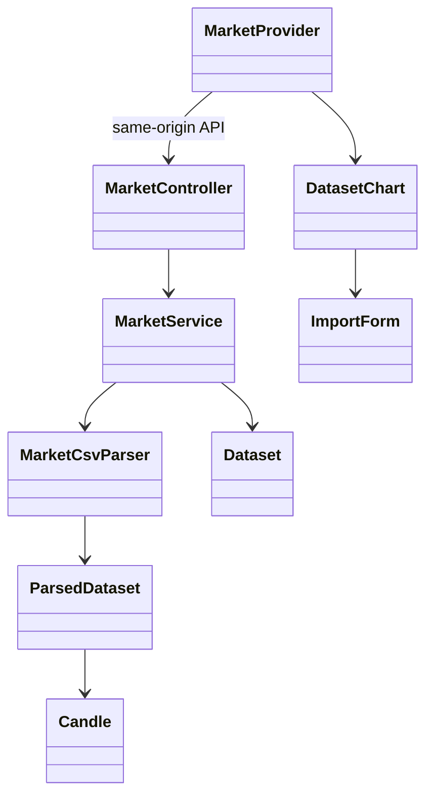
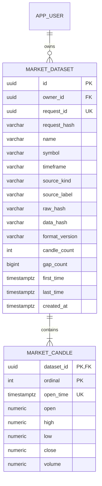

# PB-006 design — Issue #9 — 31/08/2026

## Use cases, decisions and boundaries

Authenticated researcher imports an immutable private OHLCV dataset, selects and
inspects real candles, and deletes only after confirmation. Use cases/ACs are in
spec.md; no provider, broker, strategy execution or payment work in this feature.
Reuse responsive shell, native Modal, session/CSRF, JDBC and SVG. No new dependency.
Original standalone ChartView demo/tests stay available; authenticated entrypoint
gets MarketProvider keyed by user and a real DatasetChart through ChartView.

```mermaid
sequenceDiagram
    actor User
    participant UI as Import/Chart UI
    participant Guard as Session/CSRF/body/rate limits
    participant API as MarketController
    participant Parser as MarketCsvParser
    participant DB as PostgreSQL
    User->>UI: CSV file/paste + metadata
    UI->>Guard: POST /api/datasets/import + requestId
    Guard->>API: current authenticated principal
    API->>Parser: strict bounded parse, quality, two hashes
    alt invalid
      Parser-->>UI: 422 fixed code + line, no input echo
    else valid
      API->>DB: transaction, lock current user/version
      API->>DB: replay/conflict/quota; dataset + batch candles
      DB-->>UI: immutable owned dataset
      UI->>API: GET owned dataset/candle window
      API-->>UI: exact decimal strings + UTC timestamps
      UI-->>User: real SVG chart, provenance, gaps
    end
```





## CSV and identity contract

Exact header `timestamp,open,high,low,close,volume`. UTF-8, optional initial BOM,
LF/CRLF; each cell may be surrounded by one pair of quotes. Embedded newline,
embedded quotes/comma, multiline records, arbitrary Excel expressions/delimiters,
comments and archives are unsupported and rejected. Trim ASCII spaces/tabs around
cells; numeric/time content cannot contain spaces/control characters. A trailing
line ending is allowed; internal blank records rejected. Header columns exact and
in order. Parser does not evaluate formulas or fetch paths/URLs.

CSV1MiB max,1..5000candles. Import JSON2MiB max only exact POST path. Strict JSON
already rejects duplicate/unknown fields/type coercion. Numeric grammar unsigned
plain decimal with up to13integer digits and8fractional digits, no exponent/sign,
0<=volume<=1e12,0<OHLC<=1e12; high>=low/open/close and low<=open/close.
PostgreSQL numeric(21,8) preserves exact values; API emits plain decimal Strings.
Chart converts to Number only for screen coordinates; tooltips retain exact text.

Time format exactly UTC ISO `YYYY-MM-DDTHH:mm:ssZ`, years1970..2100, valid Gregorian
calendar, epoch seconds divisible by timeframe seconds (1m,5m,15m,30m,1h,4h,1d),
and time+timeframe<=current server UTC time. No partial/future candle admitted.
Strict increasing open_time; duplicate/out-of-order records rejected, never sorted
or silently dropped. Missing intervals counted as sum(delta/timeframe-1), not filled.
PB-010 rejects gaps under DSL missingCandles=reject; this UI warns explicitly.

Two hashes: rawHash SHA256 UTF-8 CSV exactly as submitted, including BOM/CRLF;
dataHash SHA256 UTF-8 `ohlcv-v1\n<symbol>\n<timeframe>\nUTC\n` followed by
normalized `timestamp,open,high,low,close,volume\n` rows. Numbers strip trailing
zeros, no exponent; times exact UTC. Name/source metadata excluded from dataHash.
requestHash SHA256 newline-separated normalized name/symbol/timeframe/sourceKind/
sourceLabel/rawHash/dataHash (all text excludes newlines), binds idempotent intent.
Equivalent CSV formatting has same dataHash but different rawHash/requestHash.
Hashes identify content only, never authorization, feed authenticity or approval.
Source kind USER_UPLOAD or SYNTHETIC; user-provided provenance never certified.

## Database/API/concurrency

V4 only; V1–V3 unchanged. Dataset columns/rows immutable after transaction. Unique
(owner_id,request_id); candle primary key(dataset_id,ordinal), unique(dataset_id,
open_time); numeric relationship constraints at DB too. Index(owner_id,created_at
DESC,id DESC); ordered candles via PK. app_user delete cascades owned datasets;
dataset delete cascades only its rows. Future jobs must restrict deletion of a
referenced dataset snapshot, not copy mutable rows silently.

API:
- POST `/api/datasets/import` body requestId/name/symbol/timeframe/sourceKind/
  sourceLabel/csv, all required. Parse/validate before transaction writes. Lock
  current app_user credential_version; existing same requestHash returns stored
  dataset before quota check, conflicting request409. Max50datasets/account,
  each5000rows; batch insert in one transaction, rollback all on failure.
- GET `/api/datasets` returns up to20default50max items with stable created/id
  keyset cursor; all reads owner-filtered. Metadata includes fixed timezoneUTC.
- GET `/api/datasets/{id}` metadata; `/candles?start=0&limit=200` bounds start0..count
  and limit1..500, default latest200. Immutable offset paging cannot drift; response
  contains dataset,start,total,items, exact candle times/decimal Strings.
- DELETE `/api/datasets/{id}` body expectedDataHash; current-owner lock, compare
  fingerprint, delete cascade. UI only removes after204; absent/cross-owner404.

Canonical UUID syntax only; bounded cursor, start and limit. All routes require
session; unsafe operations require CSRF/allowlisted Origin. All reads max300/user/
15min, import10/user/15min, delete30/user/15min using existing atomic rate buckets.
Anonymous401 (unsafe missingCSRF403), invalid JSON/metadata400, CSV validation422
with fixed code/line/message, oversized413, conflict/quota409, rate429 with
Retry-After, unavailableDB503. No private content/SQL/stack traces in responses.
No routine migration touches an existing external DB; tests own disposable PG.

## Frontend state and presentation

MarketProvider lives below keyed auth identity, above responsive switch. Own list,
selected metadata, candle page/window, loading/error and pending import state.
Discard stale request results after switching dataset/user or unmount. Do not show
old candles under newly selected metadata while loading/failure. Selection/page
can be reopened after responsive navigation; server data survives reload/restart.
No localStorage/sessionStorage for private dataset content.

Import supports choose .csv file <=1MiB or paste, explicit name/symbol/timeframe/
sourceKind/sourceLabel. Local sample button populates a clearly labelled synthetic
CSV/form; saving still requires Import. Client rejects oversized/bad extension;
server validates content regardless of MIME/name. Filename never becomes a path.
Uncertain import retains exact request ID/payload and disables edits until explicit
retry resolves. Definite validation/permission/conflict responses permit correction;
no automatic unsafe replay. Late ack cannot appear in another user's session.

Real chart: dataset selector,50/100/200bar view, Older/Newer navigation, per-candle
inspection with UTC/time/OHLC/volume and keyboard controls, price axis/grid/wicks/
bodies from actual highs/lows (flat range padded). SVG bounds finite, empty/single/
flat series handled. No fake EMA/RSI/trade markers. Show USER_UPLOAD unverified or
SYNTHETIC, symbol/timeframe/count/date range/hash/provenance and explicit gap warning.
Delete native modal with cancel/focus restore; loading/error/empty/retry visible.
Small screen form scrolls within viewport; neutral typography and chart density
reuse shell. Standalone demo still labelled; no test removal to hide regressions.

## Security and test applicability

Test actual userA/B list/read/page/delete; current-version mutation guard, concurrent
same/different request IDs and quotas, injection/unknown-owner, SQL placeholders,
XSS text rendering, formula/path/URL/type rejection, body/CSV/row/numeric/time limits,
partial-row rollback and backend restart. Existing auth/DSL/chat suite retained.
No unrestricted file parser/upload storage/SSRF/command or template sink. Source
labels may contain bounded inert text but never instructions. No AI/provider here.
No new password implementation or dependency; inherited security covered by regression.
Real browser verifies import/persisted chart/paging/delete/isolation and responsive
layout; mocked tests alone do not prove integration. Evidence/test cases separate.
