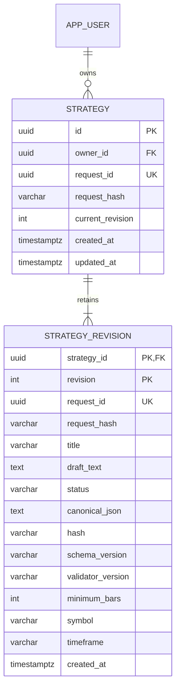
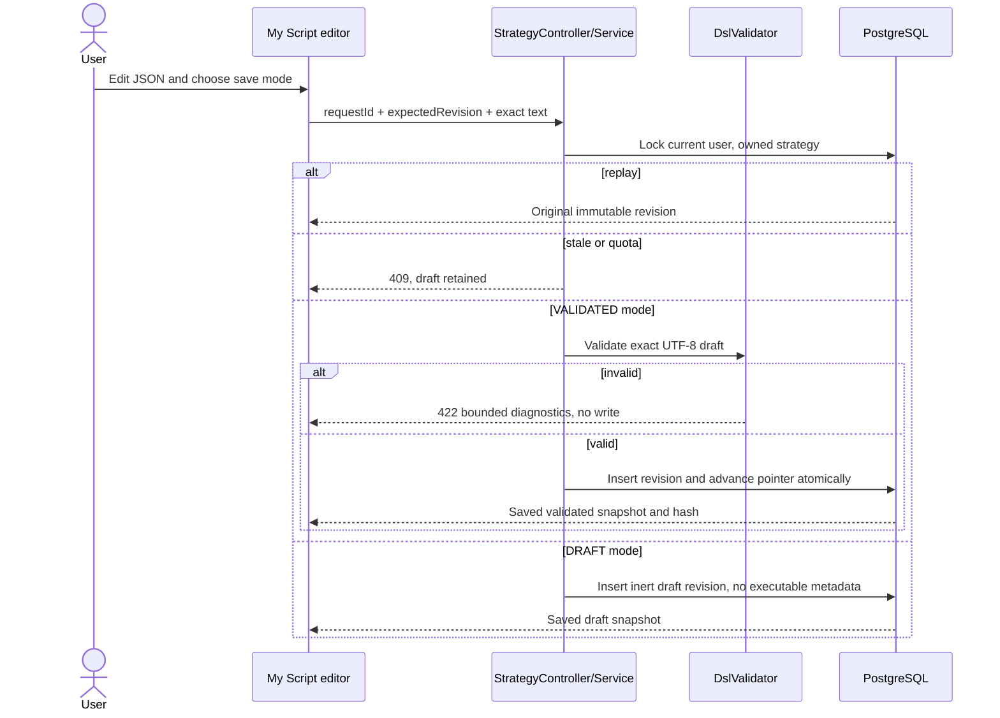
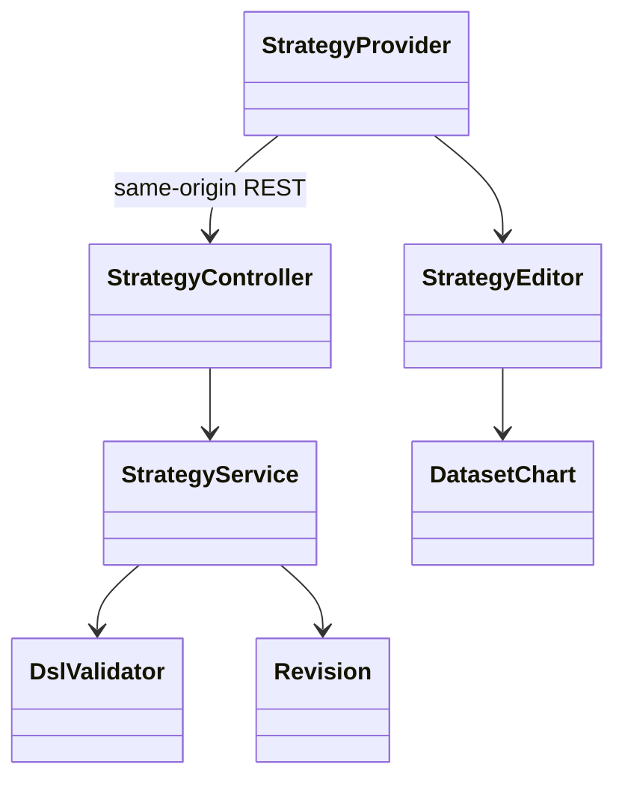

# PB-007 design — Issue #10 — 31/08/2026

Before code. Use cases and AC-STR-01–06 in spec.md. Scope: backend strategy package,
V5, route/rate/body wiring, tests, frontend strategy provider/editor and existing
workspace wiring, docs/evidence. No new dependency, AI/engine/export or DSL change.

## State and data contract

Strategy owns immutable revisions, including incomplete DRAFTs. Creating title
creates revision1 with empty draft. Every Save creates the next revision; editing
is local until explicit Save draft or Save validated revision. Validated is a
schema/semantic result, not proof of runtime availability/profit. Future jobs must
select exact VALIDATED revision and revalidate their supported capabilities.

Strategy: id,owner_id,create request_id/hash,current_revision,created/updated_at.
Revision: strategy_id,revision,request_id/request_hash,title,draft_text,status,
canonical_json,hash,schema_version,validator_version,minimum_bars,symbol,timeframe,
created_at. Status DRAFT requires all derived fields NULL; VALIDATED requires them
all. PK(strategy_id,revision), unique(strategy_id,request_id), unique owner create
request. Max100 strategies/account,100 revisions/strategy,64KiB raw UTF-8 draft;
title1..120 trimmed, valid Unicode; draft whitespace is preserved exactly. Allow
tab/CR/LF but reject other ISO controls/unpaired surrogates. JSON validity optional
only for DRAFT. No dataset FK; chart choice is context, not saved strategy binding.

No applied migration changed; strategy delete cascades its own revisions only.
Future backtest jobs add explicit revision references/delete protection themselves.

## API and transactions

- POST /api/strategies {requestId,title} → revision1. Replay same normalized title
  returns immutable revision1; a later current version remains discoverable by GET.
- GET /api/strategies?limit=20&cursor=... → bounded current metadata, no draft text,
  stable created/id order.50max. Canonical UUIDs/cursors validated.
- GET /api/strategies/{id} → current complete revision by single owner-filtered join.
- GET /api/strategies/{id}/versions?limit=20&before=N → revision metadata newest
  first, nextBefore;50max. GET /versions/{revision} → exact immutable owned version.
- POST /api/strategies/{id}/versions {requestId,expectedRevision,title,draftText,mode}
  → immutable revision. mode DRAFT/VALIDATED only, no caller derived metadata.
  Validate text first; lock current user credential_version then strategy owner;
  check same-request replay before stale/quota checks. Fingerprint uses length-safe
  JSON array of expectedRevision/title/raw draft/mode, SHA256, not delimiter guesses.
  Check expected current, quota and validate exact draft if VALIDATED, then insert
  and advance pointer in one transaction. Invalid save422 without state mutation.
- DELETE /api/strategies/{id} {expectedRevision} →204, lock current user/strategy,
  reject stale409, remove only own strategy+versions. Missing or cross-user404.
- Existing POST /api/dsl/validate is read-only validation, no stored state. UI catches
  malformed400 and semantic422 separately; saving validated never trusts this result.

Single statement read current joins strategy to its current_revision; history list
uses repeatable-read snapshot to avoid inconsistent deletion. Mutations owner lock
prevents quota/parallel edit/delete races. Idempotent revision responses return the
original immutable result even if another client advances current revision; the UI
does not silently overwrite that newer data. After uncertainty or409 it can Reload.
Request IDs are opaque intent keys, not permission. Replay survives while strategy
exists, no tombstone after explicit deletion. No background unsafe retries.

Route protection: session/CSRF/Origin, read300/write60 peruser15min with short rate
purpose names that fit existing80byte bucket key. Only exact create POST and UUID
version POST route accept512KiB outer JSON; raw draft still64KiB. Other limits stay
16KiB /64KiB DSL /2MiB market import. Strict JSON unknown/duplicate/coercion checks
reused. Fixed422 errors bounded20, no raw draft/SQL/stacktrace echo; malformed DSL
stored as DRAFT if requested, never executed.

## UI state and safe replacement

Provider under keyed authenticated identity, above responsive shell owns selected
revision/editor text/title/dirty/validation/history/loading/pending mutation. Every
async read and validation has generation check; editing invalidates old validation,
late read cannot replace dirty content; unmount/user change discards responses.
No local storage of private JSON. beforeunload warns if unsaved/uncertain; tab and
viewport changes keep provider. App account signout still intentionally ends session.

UI has New strategy title form, selector, title and plain JSON textarea, Save draft,
Validate, Save validated revision. Pending write keeps exact UUID+payload and locks
edit/switch; known4xx frees correction, unknown/network retains explicit Retry.
409 retains text and offers Reload with explicit discard confirmation. Selecting
another strategy, loading history into current editor, sample or reloading when
dirty uses an accessible local confirmation modal. Historical content is read-only
until explicit Use revision; doing so creates new local edits based on current
expected revision, never overwrites saved history. Metadata shows saved revision
status separately from unsaved validation. Selecting a history row alone cannot save.

Desktop wide editor/chart side-by-side when available; narrower screens toggle
chart with same MarketProvider context. Show exact symbol/timeframe mismatch to
last validated saved version; draft has no inferred match. Chart no automatic
backtest. Sample neutral price-action fixture is labelled synthetic and only fills
editor, no save/AI/profit claim. Existing standalone demo routes/tests remain intact.

## Security applicability

Actual two-user ownership on current/history/detail/create/delete; stale credentials,
CSRF/Origin, unknown owner/hash/status fields, quota/rate/body/Unicode boundaries,
parallel replay/stale writers/delete and DB rollback. Raw JSON hostile text remains
React textarea/pre text, SQL placeholders; no file/URL/eval/template interpreter.
Use existing schema validator for all VALIDATED revisions. Auth/password/security
regressions retained. No external credentials/provider/sandbox bypass required.
