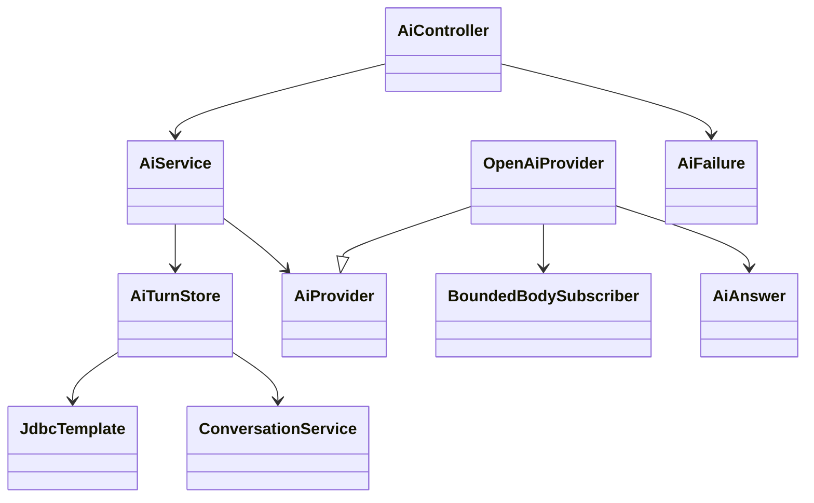
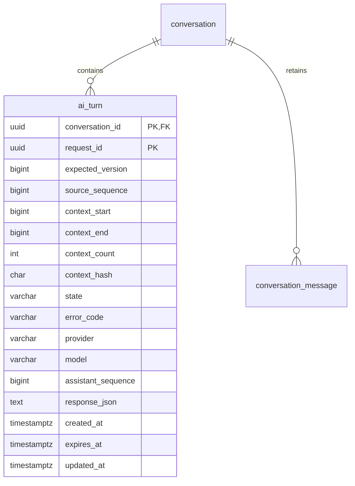

# PB-008 design — 31/08/2026, Issue #12

OpenAI Responses REST via maintained Java21 HttpClient; no new SDK dependency.
Fixed https://api.openai.com/v1/responses, no redirects, no request-selectable URL,
proxy/header/model/key or tools. Server OPENAI_API_KEY and AITRADING_AI_MODEL are
required when AITRADING_AI_ENABLED=true; disabled by default. No default model
guesses account access. Invalid/incomplete configuration fails closed, public
capability exposes configured/model/provider only, never secret details. Test-only
constructor injection supplies an owned loopback stub, no production test-mode URL.

Official sources inspected31/08/2026:
[Responses](https://developers.openai.com/api/reference/cli/resources/responses/methods/create),
[Structured Outputs](https://developers.openai.com/api/docs/guides/structured-outputs),
[data controls](https://developers.openai.com/api/docs/guides/your-data).
Use text.format json_schema strict with all fields required and no additional
properties; handle refusal/incomplete separately. store:false, stream:false,
no hosted tools/background/previous_response_id/provider conversation. This does
not promise zero retention: account/provider abuse monitoring and cache policies
still apply. UI discloses that explicitly requested context goes to configured AI.

```mermaid
sequenceDiagram
    actor User
    participant UI as Private chat
    participant API as Owner/session/CSRF
    participant Turns as Attempt transactions
    participant Provider as Fixed Responses client
    participant DB as PostgreSQL
    User->>UI: Save message, then Ask AI
    UI->>API: requestId + expectedVersion + sourceSequence
    API->>Turns: current user and owned conversation
    Turns->>DB: lock, validate, snapshot context, reserve PENDING
    Turns-->>API: detached bounded context, no transaction held
    API->>Provider: strict JSON request, bounded HTTP
    Provider-->>API: validated answer or fixed failure
    API->>Turns: finalize attempt
    Turns->>DB: recheck user/owner/version/lease/cancel; atomic append
    API-->>UI: SUCCEEDED or explicit terminal failure
    User->>UI: Check status / Cancel if uncertain
    UI->>API: same owned request identity
    API-->>UI: persisted state, never hidden provider replay
```





## API and lifecycle

GET /api/ai/capabilities; POST /api/conversations/{id}/ai-turns with exact
requestId/expectedVersion/sourceSequence; GET /api/conversations/{id}/ai-turns/
{requestId}; POST same path/cancel with empty JSON. All session protected, writes
CSRF/origin protected; existing16KiB JSON limit remains. No owner/role/content/
model/endpoint can be supplied. Start responds with full durable attempt state.
GET /api/conversations/{id}/ai-turns returns the latest owned attempt, or204 when
none, so Check AI availability can recover request identity after page reload
without browser storage. Availability is checked explicitly, not on page mount.
Provider terminal failures are explicit FAILED + fixed errorCode, not HTTP success
meaning an assistant exists. Boundary validation/access/DB failures use400/401/403/
404/409/413/429/503. Missing provider configuration is AI_UNCONFIGURED503.

Reserve transaction locks current credential then owned conversation. Existing
requestId with same version/source replays persisted state; changed intent409.
Only latest stored user message can be answered; expected conversation version
must match. Max100 attempts/conversation, max1 PENDING via partial unique index,
max4 provider calls/process,10 start requests/user/15min,300 reads and30 cancels.
Normal chat write rate120 remains additional, not bypassed. Retry after a terminal
failure requires a new explicit request ID. No automatic external retry, which
could charge twice on uncertain provider outcomes. Idempotency lasts while the
conversation exists; deleting it cascades turns and messages.

Snapshot latest at most20 messages, at most16000 Java characters; retain whole
messages in ascending sequence, exclude oldest until within budget. Last user
message is always present. Only server roles user/assistant; private title and
other conversations/strategies/documents are not sent. Fixed instructions are
separate from untrusted message content. Record first/last/count/hash but do not
store another plaintext context copy. Prompt injection cannot grant tools/access.

PENDING lease45s; expired attempts become FAILED/AI_EXPIRED on owned status/start
operations, never re-executed automatically. External HTTP occurs outside DB
transaction. Finalize rechecks current credential, owner, state, lease and exact
conversation version/sequence. Cancel→CANCELLED; stale edit→FAILED/AI_STALE_CONTEXT;
deletion/revocation denies finalization; no assistant appended. Success atomically
adds one server-generated assistant message ID and updates conversation pointer
and attempt metadata. No user-supplied role or request-ID collision can fabricate
assistant messages. DB failure after provider success leaves uncertain attempt;
expiry/retry is explicit, never a hidden provider replay.

Cancellation guarantees no later persistence, not that a billed upstream request
can be recalled. At most20s whole HTTP exchange,5s connect,256KiB response, bounded
JSON depth/value/text. Cancel outstanding future on timeout; streaming body
subscriber cancels on size overflow. HTTP errors map fixed codes, raw provider
body/key never echoed. Explicit no redirects prevents credential forwarding.

## Structured output / UI

Trusted closed schema fields kind(answer|clarification), answer string, assumptions
array of strings. Server enforces nonblank answer<=3000,0..5 assumptions each<=160,
safe Unicode/control text and total persisted<=4000. No markdown HTML interpreter.
Plain saved message combines answer and labelled assumptions. JSON provenance
remains on owned turn for future readers; no user-authored assistant role.
Provider refusal, incomplete status, missing/multiple/non-text/tool outputs,
unknown/duplicate fields, oversized/invalid JSON fail without assistant insertion.

UI leaves Save message independent of provider. Ask AI only when a selected,
fully loaded latest message is user-authored and draft is empty; disclose context
sharing. Show model/configuration, pending/status/cancel/uncertainty and distinct
fixed errors. Keep request identity while outcome uncertain. Never mix a late
old-user/conversation result; existing auth-keyed context and epoch guards remain.
Persisted history is the source of truth, not a fake local AI response.

## Applicability and external verification

BOLA/session/CSRF/rate/concurrency/input/sensitive-data tests at real HTTP/PG;
SSRF/redirect and oversized/hanging/malformed provider stub tests; text/XSS/async
UI tests; unchanged password security and dependency regressions. No PDF/upload/
path/shell/RAG/broker/payment sink. Browser missing-config test uses actual app;
success smoke must use a configured real provider with synthetic prompts only.
Contract stubs are labelled test data and never presented as real AI verification.
No available key is a real smoke-test prerequisite, not permission to read Codex
credentials or bypass external account controls. Continue safe independent backlog.
