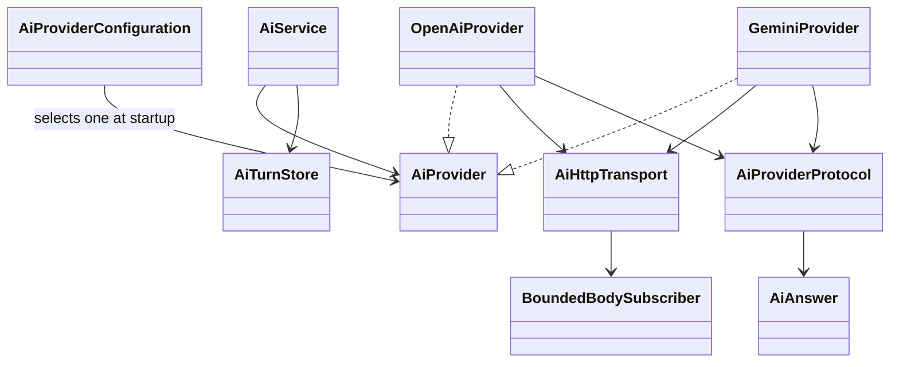
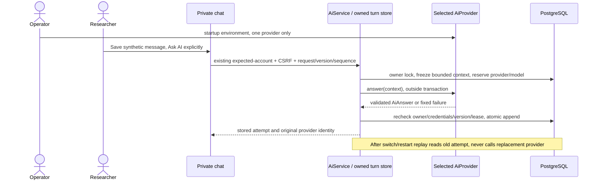

# PB-008 amendment — provider-neutral prototype

31/08/2026, Product Owner decision in chat, Issue #12. This amendment supersedes
the initial OpenAI-only provider selection/prerequisite, not the security or DoD.
Baseline761f3b47e692be69b4c81aa619cbbf4f03d42e88, clean main. No DONE feature rebuilt.
Initial spec/design/test evidence remains historical. Existing AI-01–06 still apply.

## Scope / use case

UC-AI-01 remains: save a synthetic research message, explicitly Ask AI, validate
structured answer, persist within the owned conversation. Operator selects one
provider through server environment; users cannot choose endpoints, credentials,
models or tools per request. OpenAI Responses remains optional. Gemini Developer
API is the prototype choice, using the existing JDK HttpClient, no new dependency.

| AC | Observable contract |
| --- | --- |
| AI-07 | AiService/AiTurnStore depend on AiProvider only; one selected implementation, default gemini, explicit openai optional; unknown/disabled/missing config fails closed, no fallback/network retry |
| AI-08 | Gemini fixed HTTPS generateContent route with validated model segment, header-only GEMINI_API_KEY, strict JSON answer schema, no tools/cache/files/URL context; same20s/5s/256KiB and context limits; fixed errors and no secret/body leakage |
| AI-09 | New V13 permits only openai/gemini in persisted provider metadata; preserve V1–V12 and old OpenAI rows; historical/replayed attempts retain original provider after switching/restart |
| AI-10 | Frontend validates both known providers, displays selected provider/model and synthetic-only Gemini warning, retains existing auth/CSRF/epoch/draft/error controls; no key or selection configuration in browser |
| AI-11 | Real local Gemini HTTP contract + PostgreSQL owner/race/restart/secret tests, existing OpenAI and full regressions PASS; real Gemini synthetic smoke separately required before publication/Issue completed |

Configuration (server environment, never a tracked .env):

```text
AITRADING_AI_PROVIDER=gemini
GEMINI_API_KEY=<configure securely on server; never paste in chat>
AITRADING_AI_MODEL=gemini-3.5-flash
AITRADING_AI_ENABLED=true
```

Default enabled=false; absent/empty Gemini model defaults to gemini-3.5-flash,
explicit AITRADING_AI_MODEL overrides it (invalid nonempty values fail closed). Optional OpenAI uses
provider=openai, its own OPENAI_API_KEY and compatible explicit model. No cross-key
reuse/fallback. Invalid selector is exposed as configured=false/provider=null,
never echo arbitrary selector text. Changing provider requires server restart;
in-flight old attempts expire/replay without execution under the new provider.

## Design / sequence / data





ERD unchanged from design.md: ai_turn retains conversation FK, request composite
PK, provider/model/provenance/state. V13 replaces only provider check with the two
supported values. No row rewriting, secrets column or migration repair/clean.

Provider-neutral protocol extracts the existing instructions, bounded context and
strict JSON/AiAnswer validation. Shared HTTP transport preserves all existing
timeout/redirect/size/status behavior. Gemini maps assistant→model role and wraps
plain text parts; systemInstruction is separate. generationConfig requests one
JSON candidate,2048output tokens, includeThoughts=false and store=false. Thinking
budget/level are not model-coupled; provider defaults apply within unchanged token/
time/byte bounds. Optional bounded base64 thoughtSignature wire metadata is
discarded, never persisted/replayed; no function calls need signatures. Default
safety filters remain unchanged. Reject tool/non-text/
thought output, multiple candidates, non-STOP completion, unsafe/duplicate/unknown
answer fields and malformed UTF8/JSON. Never execute provider content.

## Security / privacy / test and stop conditions

Existing owner/current credentials/expected-account/CSRF/session/rate/context/
idempotency/cancel/lease and stale-append logic remain authoritative. No production
URL override; test constructors inject loopback only. Header credential never in
query, JSON prompt, logs, exceptions, API response or frontend bundle. Reject a
provider response echoing the configured secret; no raw failure cause retained.
Local automated harness disables real provider credentials to prevent accidental
external calls. Actual Gemini calls, when authorized/configured, use new synthetic
accounts/conversations only, never existing private data. No automatic retries or
paid-provider fallback. Free-tier availability/quotas are account-dependent and
can change; do not promise unlimited or guaranteed free execution.

Google documents free-tier content use for product improvement. UI/operator docs
warn to use synthetic test data only with Gemini in this prototype. This is an
operating constraint, not a claim that software can classify all private text.
Existing full threat matrix remains; no new URL/file/role/crypto/payment inputs.

Separate test cases: provider-neutral-test-cases.md. After code/local tests PASS,
if GEMINI_API_KEY is absent: stop, report only need to configure that server key,
leave Issue12 OPEN and changes uncommitted/unpushed. Do not request pasted secrets.
Only after real Gemini smoke PASS: normal Vietnamese Refs #12 commit, main push,
exactSHA/CI verification, close if full DoD met, then newly READY backlog work.

Official references inspected31/08/2026:
[generateContent REST](https://ai.google.dev/api/generate-content),
[structured output](https://ai.google.dev/gemini-api/docs/structured-output),
[thinking configuration](https://ai.google.dev/gemini-api/docs/generate-content/thinking),
[free-tier data policy/pricing](https://ai.google.dev/gemini-api/docs/pricing).

Model amendment sources31/08/2026:
[Gemini3.5Flash model and structured-output support](https://ai.google.dev/gemini-api/docs/models/gemini-3.5-flash),
[thinking settings and optional signatures for text turns](https://ai.google.dev/gemini-api/docs/generate-content/thinking).
Do not infer account access from model documentation. Actual model/access errors
must stop this amendment without fake output or switching to another model.
`store=false` requests no stored generation; provider data-use/retention policies
still apply and this is not a zero-retention claim.

Planned paths: backend ai protocol/transport/configuration/Gemini/OpenAI adapter,
V13 and foundation migration assertion, ai tests; frontend chat API/provider label/
tests; scripts/test_backend.py and synthetic smoke tooling as needed; README,
Issue12, PB008 docs/evidence, master backlog/execution state. No governance change.


31/08/2026 — PO approves Gemini default gemini-3.5-flash; PB-008 resumes IN_PROGRESS.
Previous 2.5 Flash failure evidence retained. Model override stays server-configurable;
no provider-specific business logic, new dependency or fallback. Local regression
and real synthetic structured/persistence/isolation smoke pending for this revision.
Issue #12 approval receipt: https://github.com/tranbaohoang10/AITrading/issues/12#issuecomment-5480218688
