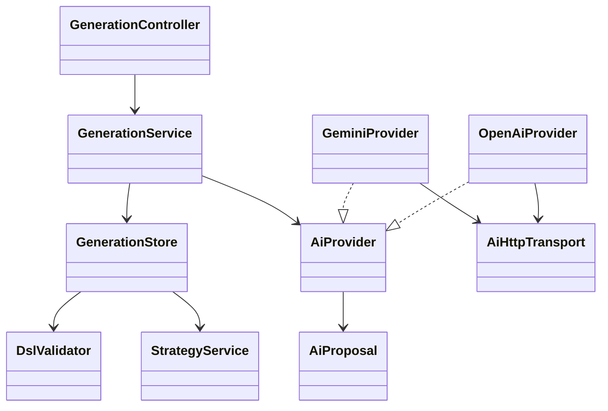
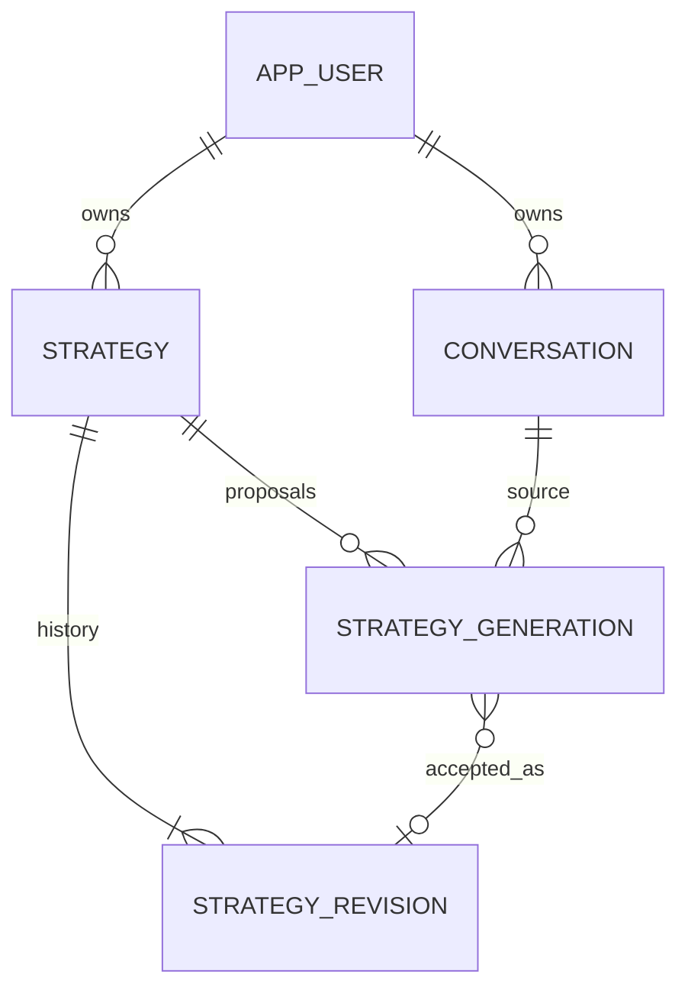

# PB-009 design — 31/08/2026, Issue #21

Reuse PB008 selected AiProvider, fixed HTTPS/JDK HTTP and shared strict parser.
Add typed strategyProposal operation without changing ordinary answer semantics.
Provider receives trusted local DSL1.0.0 schema plus method-neutral instructions
and frozen saved conversation context only. No current unrelated strategy text,
user secrets, other conversation, URL, file, cache, tools or code execution.
Return closed kind=proposal|clarification, explanation, assumptions, questions,
dslJson(string or null). Proposal requires nonempty DSL and no questions;
clarification requires null DSL and at least one question. Strict UTF-8/duplicate/
unknown-field checks, explanation<=1500 chars,5 assumptions/questions<=160 chars,
DSL<=64KiB UTF-8, schema semantic validation/canonicalization by DslValidator.
Invalid structured or DSL output becomes fixed failure, never READY. No automatic
repair or hidden external replay. Model semantics still require explicit review.

Both adapters keep20s whole-call/5s connect/256KiB response bounds and no redirects;
proposal token cap8192 is separate from unchanged ordinary-chat2048. A shared
four-permit transport limit protects both operations/provider instances. Same
ai-start10/account/15min allowance prevents bypass via the generation route;
existing strategy read/write limits also apply. No added dependency.

## API / lifecycle

POST /api/strategies/{id}/generations with requestId,expectedRevision,
conversationId,expectedConversationVersion,sourceSequence (no raw prompt/owner/
provider/model/URL/DSL). GET latest and /{requestId}; POST /{requestId}/cancel,
/reject and /accept. Accept/reject/cancel body empty; identity entirely in route
and authenticated principal. Current expected-account header and CSRF enforced.

Reserve under current credential/user→strategy→conversation row locks, verify
both owner predicates and expected versions/latest user sequence. Freeze most
recent20/16000 chars, range/count/hash and provider/model. One pending/strategy,
100attempts/strategy; request intent exact replay or409 conflict. External call
outside transaction. Finish reacquires same locks and validates active lease/
source version/strategy revision/current credentials before persisting READY or
CLARIFICATION; otherwise FAILED with safe reason. Missing/deleted resources404.
40s durable lease expires on status/start/accept checks; expired attempts never
call provider again. Cancel marks CANCELLED; late output cannot be appended.

Accept READY rechecks current strategy revision and both owned resources, uses
StrategyService.save(VALIDATED) for trusted canonical DSL/current title with the
generation request UUID. Record accepted revision atomically; duplicate accept
returns the same immutable revision even after later strategy edits. Reject only
READY/CLARIFICATION, idempotently records REJECTED. Neither action calls AI.
No generated assistant is silently appended to chat; proposal/clarification lives
in its own durable record, shown next to saved source context and strategy.

## Class / sequence



```mermaid
sequenceDiagram
  actor User
  participant UI
  participant API as GenerationService
  participant Store as GenerationStore
  participant AI as Selected AiProvider
  participant DB as PostgreSQL
  User->>UI: Save chat request; Generate DSL proposal
  UI->>API: owner-bound IDs + expected revisions + CSRF
  API->>Store: reserve frozen owned context
  Store->>DB: PENDING,40s lease,context hash
  API->>AI: bounded structured proposal (outside transaction)
  AI-->>API: untrusted proposal or failure
  API->>Store: validate/recheck/persist
  Store->>DB: READY / CLARIFICATION / FAILED
  API-->>UI: authoritative durable result
  User->>UI: Review and explicitly confirm Accept
  UI->>Store: accept same request
  Store->>DB: revalidate + one immutable VALIDATED revision
  Note over UI,DB: No automatic editor overwrite, backtest, export or execution
```

## Data / ERD

V14 creates strategy_generation, compositePK(strategy_id,request_id), strategy FK
ON DELETE CASCADE, conversation FK ON DELETE CASCADE; owner always derives from
both resources, never request input. Fields: expected strategy/conversation
versions/sourceSequence, frozen contextHash/range/count, provider/model,
state/error, proposalJson/canonicalDsl/hash, acceptedRevision, timestamps/expiry.
DB checks states/provider/hash/bounds/terminal payload combinations, unique
pending strategy. Context messages are read from existing DB and not duplicated;
persist input identity/provenance and bounded result only. Preserve V1–V13.



## UI

My Script proposal section uses selected saved conversation/latest user message
and selected strategy. Show exact source/target labels and versions, availability,
synthetic-only Gemini warning. Disable generation with unsaved conversation or
strategy edits, pending requests, stale/failed reads or identity transition.
Show durable latest proposal/status, clarification questions, inert DSL preview,
explicit accept confirmation/reject/cancel/status controls. Do not overwrite
unsaved editor work; after acceptance offer explicit reload of saved revision.
React epoch/request identity ignores late source/target/account responses.
Server enforces all checks independently. Mobile/tablet scroll within workspace;
use existing typography/colors/controls without new decorative theme.

## Security / limits

Existing current-session/account/CSRF, owner isolation and parameterized SQL stay.
Assess IDOR/BOLA, privilege/revocation, prompt/JSON/SQL injection, unknown fields,
XSS, replay, cancellation/races, quota/concurrency, secret/raw-error leaks,
dependency audit and database failure. No new upload/path/URL surface. No payment
or live-money actions. Gemini real smoke only new synthetic accounts/data; keys
in child environment only. Provider unavailability is not mocked as success.
