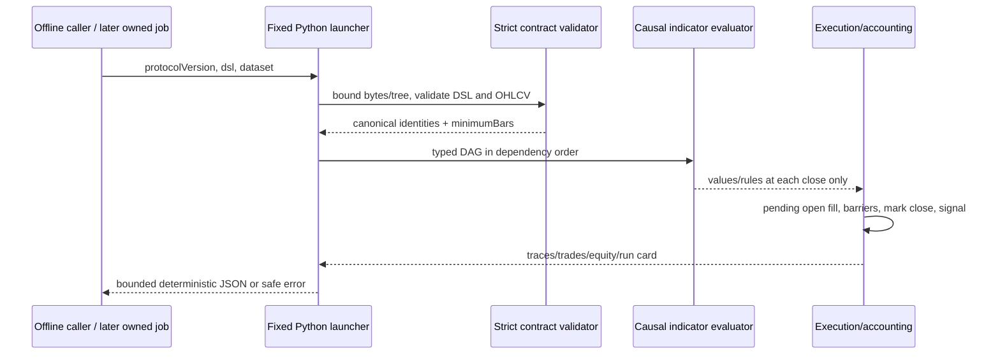
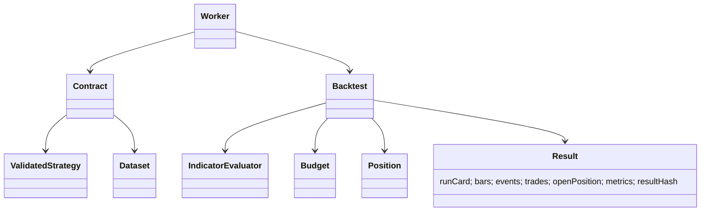

# PB-010 design — 31/08/2026

Issue #11. PB-005 v1 grammar/indicator/risk semantics remain immutable. New Python
stdlib-only package is an offline reference engine, not a public authorization
boundary. A fixed launcher reads bounded UTF-8 JSON from stdin; no arguments,
caller paths, network, subprocess, eval or user plugins. Later PB-011 resolves
owned immutable snapshots and supervises the process with an external timeout.

## Boundary and identity

Request exact fields protocolVersion1.0.0, dsl object, dataset object. Dataset exact
fields symbol/timeframe/timezone(UTC)/sourceType(USER_UPLOAD or SYNTHETIC),
closedThrough (explicit UTC cutoff), candles. Each candle timestamp/open/high/low/
close/volume; numbers are unsigned plain decimal strings matching PB-006 (<=13
integer/8 fractional digits, <=1e12, prices>0, volume>=0). Timestamps strict UTC
seconds1970..2100 inclusive year; rows aligned, contiguous, no duplicates. Every
close<=cutoff. Cutoff is explicit reproducible caller provenance, not a verified
clock or proof of authentic market data; PB-011 must use server-owned imports.
No filling gaps or silently changing symbol/TF. No supplied hash bypasses checks.

Use the existing trusted bundled schema file with a closed subset validator,
then the same semantic DAG/unit/risk/warm-up checks as Java. Strict JSON rejects
duplicate keys/trailing/BOM/nonfinite/coercions/unpaired surrogates/controls.
DSL canonical1 and OHLCV ohlcv-v1 identities match prior Java contracts. Run card
includes engine/protocol/DSL/validator/decimal-policy versions, canonical config,
minimumBars, dataset source/cutoff/range/count/dataHash and inputHash. No raw CSV
hash is claimed. resultHash covers the deterministic result excluding itself.

Bounds: input2MiB, DSL canonical64KiB/tree2048/depth24, candles5000, indicators32,
conditions128/depth8; validate even unused indicators. Work budget5million units,
cooperative monotonic15-second deadline across validation/calculation/encoding,
output32MiB. Later supervisor adds a hard OS process deadline; an idle stdin pipe
is not covered by cooperative compute timeout. CLI fixed error codes/no traceback,
exit2 invalid/limit, exit3 internal failure. No partial output on failure.

## Causality and precision

Decimal precision34, ROUND_HALF_EVEN with a fresh local context independent of
caller's process settings; no binary floats. Exact input/canonical numbers; recurring
arithmetic rounds to34 significant digits. Output decimal strings use plain notation,
no locale/exponents/trailing fractional zeros; no arbitrary currency rounding.
Broker ticks/lot constraints and external-target precision are not simulated.

Compute each DAG series in causal bar order. Rolling full windows; EMA first SMA;
RSI/ATR Wilder seeds as PB-005. Undefined source breaks/restarts contiguous seed,
never forward-filled except explicitly retained confirmed pivot series. Pivot
confirmation at original+right; ties rejected; trendline uses last two confirmed
original indices, no backfill. Record indicator values and nullable rule truth per
bar. Three-valued NOT/all/any; null rule disabled. No global minimumBars gate:
individual operands become defined independently, unused indicators do not delay
an unrelated valid rule. minimumBars remains descriptive lower bound for all
declared artifacts, not an assurance of a pivot or trade.

## Execution and accounting

At bar open execute previous close's pending exit before barriers; or enter when
flat. No same-open reverse/re-entry after an exit. Protective barriers then use
this bar OHLC (including entry bar), before marking close and evaluating new
signals. Long/short simultaneously true while flat skip both. While positioned
only its explicit exit rule schedules next-open exit; no implicit opposite exit.

Margin = positive current realized balance * allocationPct/100; notional=margin*
leverage; quantity=notional/actual adverse entry fill. Cash balance tracks realized
P&L and commissions (margin is not spent cash); equity=balance+unrealized P&L.
Entry fee is charged immediately, exit fee at exit, each actual fill notional.
No entry if balance<=0; no invented bankruptcy/liquidation cap. Gaps can create
negative equity beyond allocated margin, explicitly reported. No funding/interest.

Adverse fraction=(spreadBps/2+slippageBps)/10000: buy raw*(1+fraction), sell
raw*(1-fraction). SL/TP thresholds derive from actual entry fill. Long stop gap
raw=min(open,stop), short max(open,stop); TP raw=target even if gap favorable.
Stop takes precedence if both barriers touched, including a favorable open followed
by the opposite barrier (conservative fixed policy). Explicit next-open rule exit
precedes barriers. Each exit also incurs adverse spread/slippage and commission.

Trace separates signal/confirmation bar close, execution open, and protective bar
interval: exact intrabar exit time is unknown and remains null, never a fake open
timestamp. Closed trade gross=(exit-entry)*quantity*direction, net=gross-entryFee-
exitFee. At dataset end cancel pending order (separate termination record, not a
causal event); retain open position marked to final close, no exit fee before fill.
Events/past bars are prefix invariant; terminal summary/cancel/open MTM naturally
changes when a dataset is extended. Equity curve drawdown uses peak beginning at
initial capital; losses never removed. Metrics count closed trades only; win rate
null with no closed trades, profit factor null if no losses, no fabricated Sharpe.

## Security applicability

Strict schema/data and operation/output limits address malformed input/injection
and denial of service. Inert names/labels never become code or paths. Fixed local
schema is trusted repository content, not caller $ref. No network or file write
sink: SSRF/traversal/upload/XSS/CSRF/session/BOLA are N/A inside offline worker;
negative input tests and unchanged authenticated API regressions still required.
No user data/secret logging. Java job ownership, external hard timeout and durable
resource budgets are explicit PB-011 obligations, not claimed by this package.
