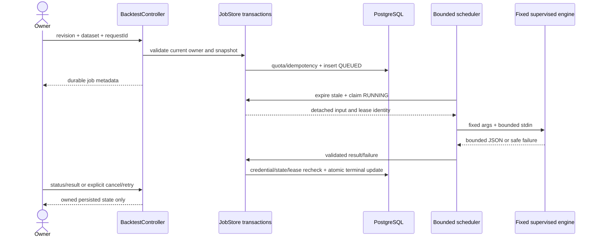
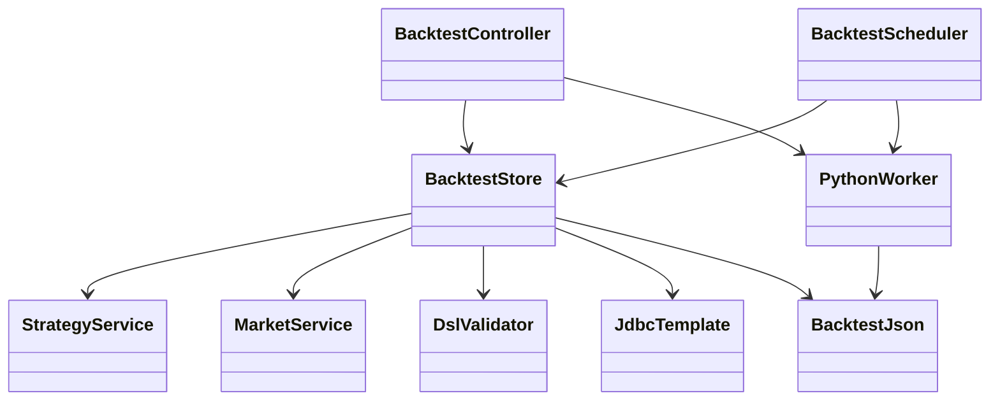
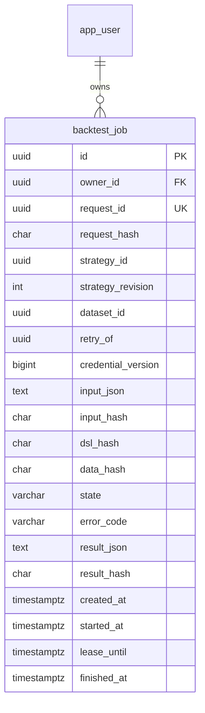

# PB-011 design — Issue #13, 31/08/2026

## Input and durable data

POST /api/backtests exact {requestId,strategyId,revision,datasetId}; no DSL, candles,
owner/model/paths/commands accepted. Require revision1..100, canonical UUIDs, current
credential and same owner. Revalidate immutable VALIDATED DSL/hash; dataset symbol/
timeframe matches, no gaps, enough warm-up bars, at most5000 immutable candles.
Take current user lock before reading sources, matching existing mutation locks.
Freeze protocol1.0.0 canonical input including exact decimal strings, full DSL,
UTC timestamps and last-bar-close cutoff. Source upload already validated closed
bars. Recheck that cutoff against server acceptance time; it stays identical across
repeated runs of the same immutable input. Canonical input
<=2MiB; SHA256 must agree with Python runCard inputHash.

V7 backtest_job stores owner FK, server UUID, unique(owner,requestId), request hash,
source IDs/revision/titles/hashes as provenance, captured credential version,
input JSON/hash, state/error, engine/result metadata, created/started/finished/lease
times. Source IDs are provenance, not cascade FKs: deleting original source cannot
erase or mutate a run snapshot. Account deletion cascades jobs. Result stored
atomically only on SUCCEEDED, max32MiB. No input/result in list metadata or logs.
Explicit terminal-only DELETE permits bounded storage cleanup; preserves Git history.

Idempotency fingerprint covers operation and original intent. Create replay returns
the existing job before re-reading possibly deleted sources; changed intent409.
Retry POST /api/backtests/{id}/retry {requestId} only for owned FAILED/CANCELLED;
new job copies the original immutable snapshot and records retryOf, new current
credential. Same retry UUID replays, no implicit rerun of a failed job.

Limits:20 jobs/account,100 jobs/database,2 active(account),16 active(database),2
RUNNING(database),2 local worker threads; input2MiB/result32MiB per job. A fixed
PostgreSQL advisory transaction lock serializes admission/global claims; never
hold it over Python execution. Per-user starts/retries10,cancel/delete30,reads300
per15min. Existing16KiB request limit remains. List uses creation-time/UUID keyset
pagination20 default50max. GET /api/backtests/{id}/result only SUCCEEDED; otherwise409.
GET /api/backtests/capabilities exposes availability/limits, no executable paths.

## Execution / recovery

QUEUED → RUNNING → SUCCEEDED|FAILED; queued/running → CANCELLED. Terminal monotonic.
Expose phase only, no fabricated percent/bar progress. Queued expiry5min; RUNNING
lease60s. Scheduled polling claims eligible jobs atomically, skips locked rows,
checks current credential, and submits to bounded workers. Interrupted RUNNING
leases become FAILED/WORKER_INTERRUPTED; never silently rerun a started process.
Queued work survives restart and may be claimed once. Cancel acknowledgement
commits state first; supervisor then terminates its owned process, late output
cannot publish. Revocation also discards output. Database failure cannot publish
partial results; remaining running lease expires and retry is explicit.

Claim locks advisory then job (no user row lock); owner mutations/finalization
lock user then job. Claim performs a credential predicate but never waits for a
user lock while holding advisory/job locks. Finalization rechecks credentials.
No database transaction remains open while waiting on a process or pipe.

Operator supplies absolute AITRADING_PYTHON_EXECUTABLE; fixed launcher derives from
trusted AITRADING_PROJECT_ROOT (or repository cwd/parent-backend fallback). Validate
regular local files; request cannot override config. Test harness passes its actual
sys.executable/root. Command fixed [python,-I,run_supervised_backtest.py], no shell.
Clear inherited environment, preserve only required Windows system-directory
variables and fixed UTF-8 locale, never DB/AI keys or session data. Stdin carries
bounded frozen JSON only; close after writing. Concurrent bounded stdout32MiB+newline
and stderr4KiB readers, independent wall25s watchdog and cancellation polling;
the watchdog still terminates the child while a DB status lookup is slow. Kill only owned process
and descendants, await termination. No raw stderr or input returned/logged.

Supervised Python entrypoint sets OS resource controls before importing engine:
512MiB address-space limit and20s CPU on Unix; Windows Job Object process-memory
512MiB,process CPU20s,one-process/no-child and kill-on-job-close. Fail closed if
required controls unavailable. Unix also limits core/file output/open descriptors;
Java wall limit covers blocking stdin and scheduler interruption. Limits are for
trusted deterministic Python only; no promise of general hostile-code containment.
Existing offline launcher/engine semantics unchanged.

Resource API references inspected31/08/2026:
[Windows extended limits](https://learn.microsoft.com/en-us/windows/win32/api/winnt/ns-winnt-jobobject_extended_limit_information),
[Windows flags](https://learn.microsoft.com/en-us/windows/win32/api/winnt/ns-winnt-jobobject_basic_limit_information),
[Python resource](https://docs.python.org/3/library/resource.html).
Memory means committed process memory on Windows and address space on Unix;
these are distinct OS measures, not a claim of identical resident-memory accounting.

Validate UTF-8/strict JSON/duplicate/trailing/depth/number/string/tree bounds;
success envelope and required result/runCard structure, engine/protocol versions,
exact input/DSL/data hashes/canonical DSL/bar count and index/time bounds; recompute
canonical resultHash before storage. Fixed safe failures for malformed worker,
exit/protocol mismatch, timeout/cancel/resource/configuration. No zero-trade fallback.
Record worker/engine version and server snapshot provenance separately from
unverified source provenance; neither hashes nor past returns guarantee profit.

## Scope and verification

New backend/backtest classes/tests,V7,supervised Python launcher/resource helper and
tests; test harness provides Python config. Narrow security matcher/rate additions,
foundation migration assertion and capability metadata if needed. README/architecture/
CNPM/backlog/evidence checkpoints. No UI/dependency/applied migration changes expected.
PB-012 owns real web controls/results, later notifications PB-022. Tests use actual
owned disposable PostgreSQL and trusted synthetic engine data, never user databases.
