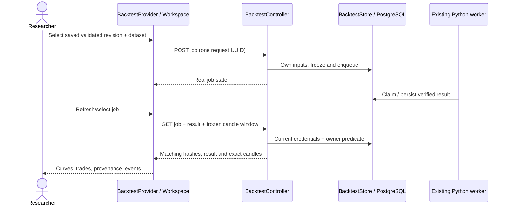
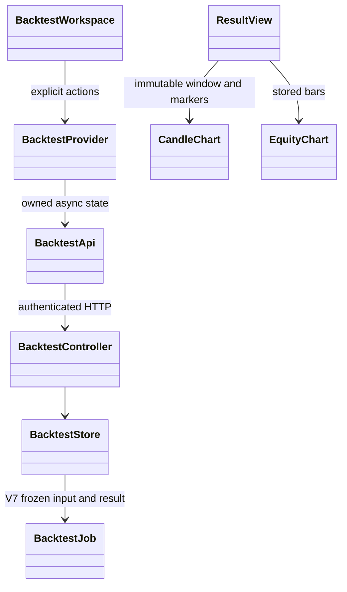

# PB-012 design — Issue #14

31/08/2026. Dependencies PB-001/006/011 are delivered. Reuse their API, chart and
responsive shell. No new dependency, migration, engine policy or stack change.

## Sequence

## Classes and data

Existing ERD remains app_user 1:N backtest_job. Frozen source IDs are provenance,
not cascade foreign keys. Add GET /api/backtests/{id}/candles?start=0&limit=100,
start 0..count, limit 1..500. Return jobId/inputHash/dataHash/symbol/start/total/items;
each item has global ordinal, UTC time and exact decimal strings. SUCCEEDED only.
Current credentials/user row lock and owner predicate prevent deletion/revocation
races; existing read rate bucket applies. Do not return owner/credentials/input DSL.

## UI and concurrency

Provider lives inside authenticated identity-keyed subtree, outside responsive
panes. Load history/setup explicitly; select saved strategy revision independently
of editor state; never run unsaved text. Preserve selected input IDs on refresh.
Use intent UUID until a definitive response; uncertain create/retry locks setup
and has an explicit same-intent retry. Job/result/candle epochs invalidate stale
responses on selection, refresh, mutation and unmount. No automated resubmission.
Authenticated reads also verify the current server account before publishing,
so a shared session switched in another tab clears this workspace on its next
server read. Already-rendered pixels are not claimed to be instantly revoked.
Manual refresh exposes actual lifecycle, not fabricated percentage progress.

Native SVG geometry uses finite numbers only; labels/export retain engine decimal
strings. Curve inspection exposes exact balance/equity/drawdown at UTC close.
Paginate trades/events/candles; maintain frozen chart separate from MarketProvider.
Signal markers use barIndex and distinguish signal-close from next-open fill;
BAR_INTERVAL exits show the interval and unknown exact timestamp. Open positions
are not closed trades. Null ratios mean undefined, never zero. Show costs, source
kind/unverified status, engine/input/data/DSL/result hashes and research disclaimer.
Explicit JSON export uses a static safe filename, inert data and selected result;
no secrets, HTML, CSV formulas or client storage. No external browser requests.

## Threat applicability

BOLA/IDOR/current credential enforcement, XSS labels, malformed response bounds,
async identity races, duplicate mutation replay, CSRF and read quotas apply.
No new auth/session/password, upload, URL fetch, subprocess, AI or dependencies;
their existing tests remain regression requirements. No bypass of security to pass.

## Verification

See test-cases.md. Real API/PG/Python plus browser at desktop/tablet/mobile,
source deletion/reload, unit contract/state/race cases and full relevant regression.
Publication is incomplete until exact main SHA and actual CI are verified.
