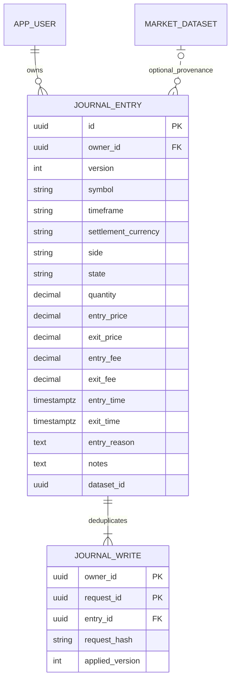
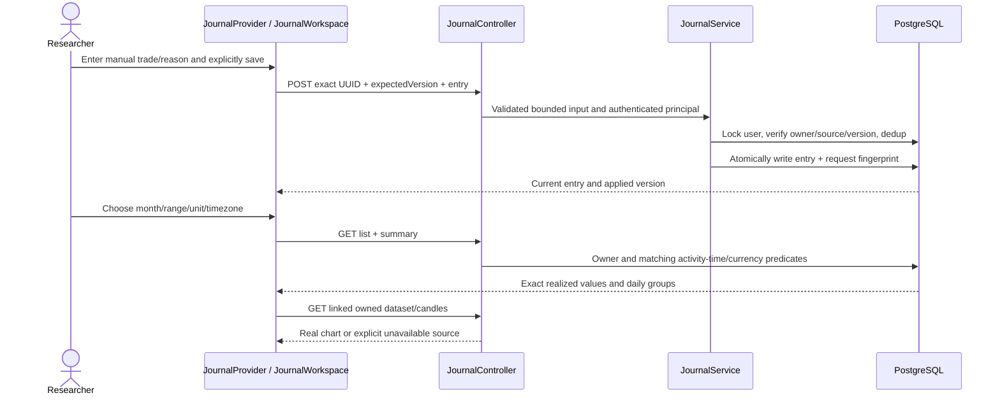
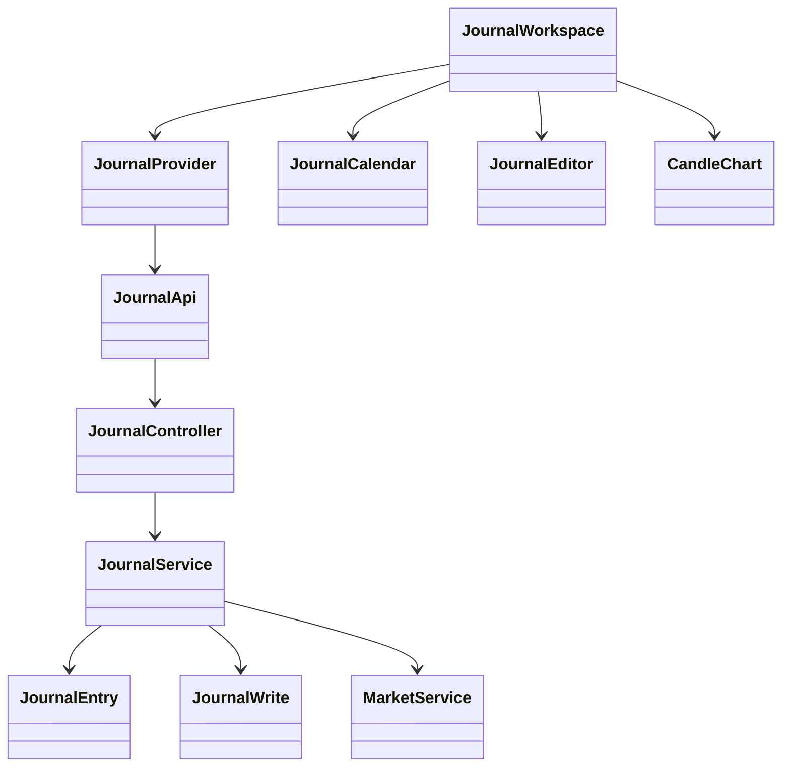

# PB-013 design — Issue #15

31/08/2026. Inspected actual main493b737, completed PB-003/006/012, requirements,
AppShell journal placeholder and current auth/market/storage tests. No journal
implementation exists to reuse; reuse shell, auth, CandleChart and dataset APIs.
Fixed stack unchanged; no new runtime dependency. PB-014 owns AI reason scoring.

## Domain and accounting decisions

Manual linear trade records, not broker/engine-imported execution claims. Quantity
expresses actual exposure. Gross=(exit-entry)*quantity*direction (+1 LONG,-1 SHORT),
net=gross-entryFee-exitFee. Exact bounded BigDecimal arithmetic, no binary float or
invented contract multiplier/FX/funding/leverage adjustment. Price/quantity >0 and
<=1e12, fees0..1e12, all at most8 fractional places. Return canonical decimal strings.
Settlement currency required: uppercase alphanumeric2..12; aggregates filter one
unit, never convert or mix currencies. Do not claim support for inverse contracts.

OPEN requires null exit time/price and zero exit fee; CLOSED requires exit time/
price, exit>=entry, nonnegative fees. Record actual past UTC instants (millisecond
precision,2000..2100 bound and no future timestamps); reporting timezone is separate.
All fees are recognized with the closed trade on exit time; OPEN is excluded from
realized P&L, including its entry fee until close. Explicitly label this accounting
convention and avoid portfolio/unrealized/margin claims.

Entry reason required, stripped nonempty max2000UTF-8bytes; notes optional max4000
UTF-8bytes. Allow multiline/tab but reject invalid surrogates/other control codes.
Bound the complete JSON to existing16KiB filter. Symbol follows existing market
identifier; timeframe uses existing supported enum. No caller owner/P&L/status
calculation overrides. Unknown JSON fields fail through the existing strict mapper.

## Data / ERD

V8 additive migration only; V1–V7 untouched. Unique entry(id,owner) supports composite
write ownership/cascade. Account deletion cascades all journal data; explicit entry
delete also removes dedup metadata and all private text. No hidden old note copies.
Dataset ID is provenance, not a cascading FK: source deletion keeps the trade;
chart shows unavailable. Validate owner+matching symbol/timeframe on each save;
editing a deleted-source record requires explicitly unlinking or replacing source.
500 entries/account and100 accepted writes/entry bound storage. Request ledger
contains hashes/version only, no repeated private note bodies. Replays are supported
while entry exists; after confirmed deletion never reuse its prior mutation intent.

## API and concurrency

- GET /api/journal?from&to&zone&currency&limit&cursor: owned activity list; from/to
  are inclusive local dates, server uses[from.startOfDay,to+1.startOfDay) in zone.
  OPEN activity=entryTime; CLOSED activity=exitTime.20default/50max keyset page.
- GET /api/journal/summary with same range/unit/zone: daily rows incl zero days,
  totals of closed trades/fees/wins/losses/breakeven and open records in range.
- GET /api/journal/{id}: owned current entry independent of report range.
- POST /api/journal: {requestId,expectedVersion:0,entry:{...}}.
- POST /api/journal/{id}: same envelope with expectedVersion>=1.
- DELETE /api/journal/{id}: {expectedVersion}; version conflict409, missing404.

Writes return {requestId,appliedVersion,entry}; replay returns current entry and
original appliedVersion. Thus a delayed retry cannot silently replace a later edit.
Hash normalized intent including operation/id/expectedVersion/data; owner-scoped
UUID collision with changed intent409. User lock→owned entry lock→version check→
entry+ledger atomic. Same user lock serializes quota and dataset mutation races.
Parameterized queries/current credential checks on every read/write/report. No
transaction spans browser calls. GET rate300 and write60/account/15min; normal
CSRF/Origin/session/body controls remain. Deletion has explicit UI confirmation.

All unsafe journal requests additionally require X-Workspace-User equal to the
authenticated principal ID. This is an expected-account precondition, never an
owner selector: a stale tab cannot write its A draft into a new shared B session.
Missing/mismatched header401 before application SQL. Reads still verify account
before display; per-request backend session binding closes the mutation race.

Ranges1..366 local dates; IANA zone validated by ZoneId, max64characters. Return
range/currency/zone identity with responses. DST day lengths derive from local
midnight boundaries, not fixed86400second arithmetic. Totals use exactly the same
activity predicate as paged list; no aggregate P&L for mixed currencies. Test New
York DST and Asia/Ho_Chi_Minh UTC boundary, leap day/year/month crossings.

## Sequence

## Classes / UI

JournalProvider inside the authenticated keyed subtree retains draft/report/entry
state through mobile/desktop changes. Epochs and current-server-user verification
discard stale cross-entry/range/account data. Preserve uncertain UUID and payload,
including rejected retries; block edits until verified. First definite validation
error remains editable. Dirty selection/new/refresh requires explicit discard
choice; conflict never erases draft. Saved notice distinguishes applied/current
version. No automatic persistence, trade run or AI action.

Current-month(default UTC),previous/next month and custom inclusive dates; explicit
unit and timezone controls. Calendar/daily table shows real zero/no-trade states,
summary and paged entries. Selected trade+reason/editor left, owned related chart
right on wide screens; stack/toggle on mobile. Link selector only lists owned
matching datasets. Chart loads via existing owned API into separate local state,
not global current-market selection. Center bounded100candle window on entry
using actual timestamps: scan at most10 pages of500 to locate gaps correctly,
then load the selected100-window; warn if timestamp outside source range. Manual times/
prices remain authoritative input, chart candles do not verify fills. No demo
profits, fake sample history, quote conversion, provider score or external orders.

## Security / testing

BOLA/IDOR,current credentials,CSRF,SQL/HTML injection,mass assignment,resource/rate
bounds,version/duplicate races,DB rollback and exact monetary/time arithmetic apply.
No new file upload,URL fetch,shell,crypto/session issuance or provider boundary;
existing regression tests still run. See detailed test-cases.md. Actual local
browser+HTTP+PG, restart and responsive checks plus final CI required before DONE.
