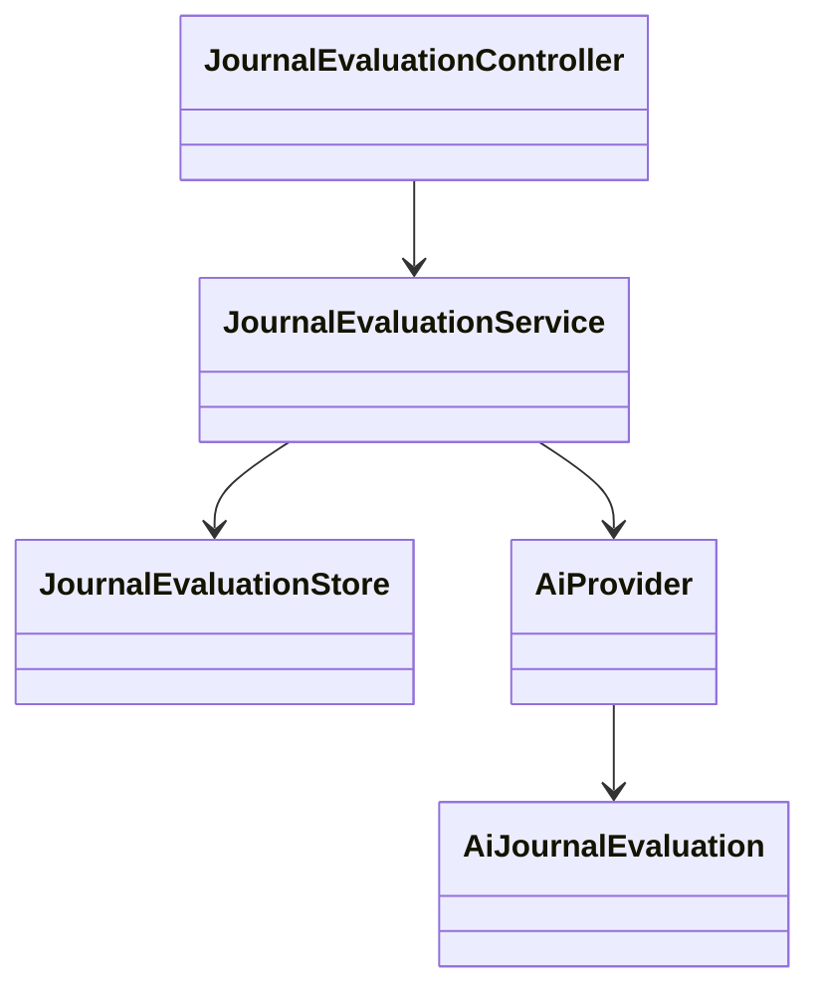

# PB-014 design

```mermaid
sequenceDiagram
  actor Owner
  participant UI
  participant API
  participant DB
  participant AI as AiProvider
  Owner->>UI: Evaluate saved reason
  UI->>API: POST requestId + expectedVersion
  API->>DB: Lock owner/journal; persist PENDING snapshot hash
  API->>AI: Bounded structured snapshot outside transaction
  AI-->>API: Evaluation / insufficient / failure
  API->>DB: Re-lock; reject stale or ungrounded output; persist terminal state
  UI->>API: Reload owned durable result
```



V15 adds `journal_evaluation`, keyed by journal/request and owner, with captured
version/hash, provider/model, bounded result, computed score and terminal state.
One pending request and 100 historical attempts per journal bound resources.
