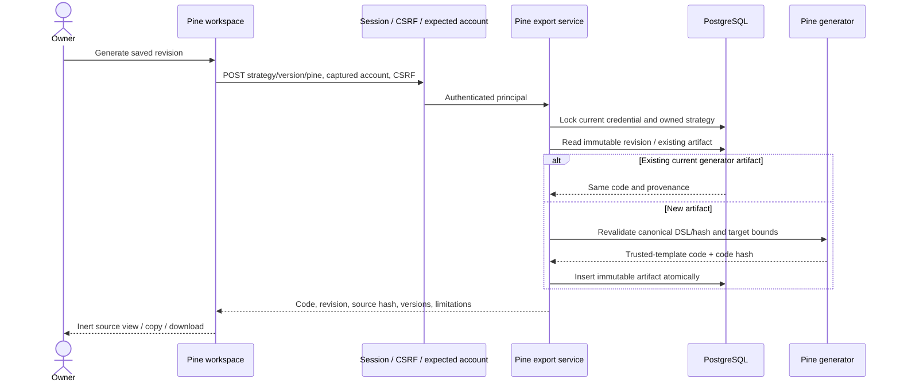
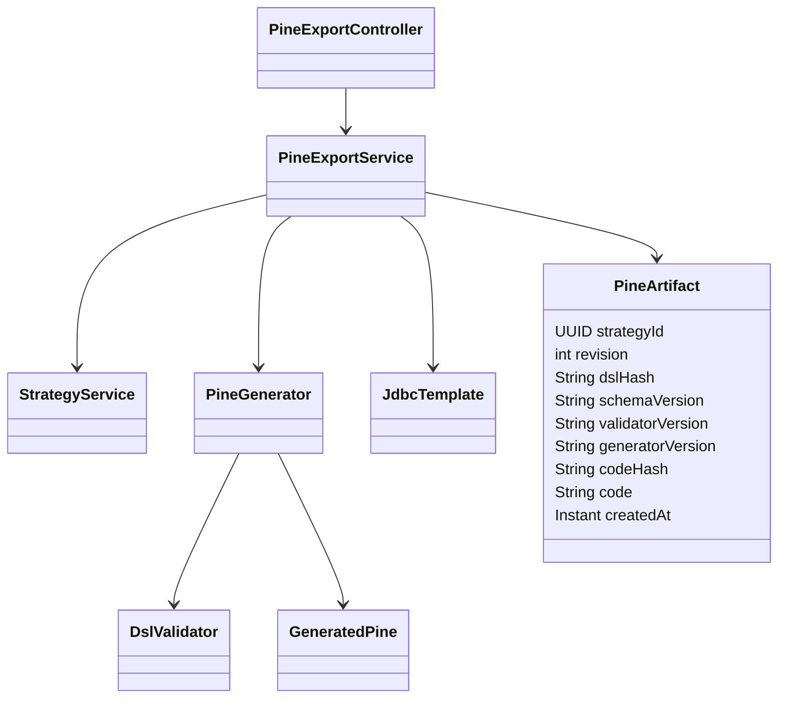
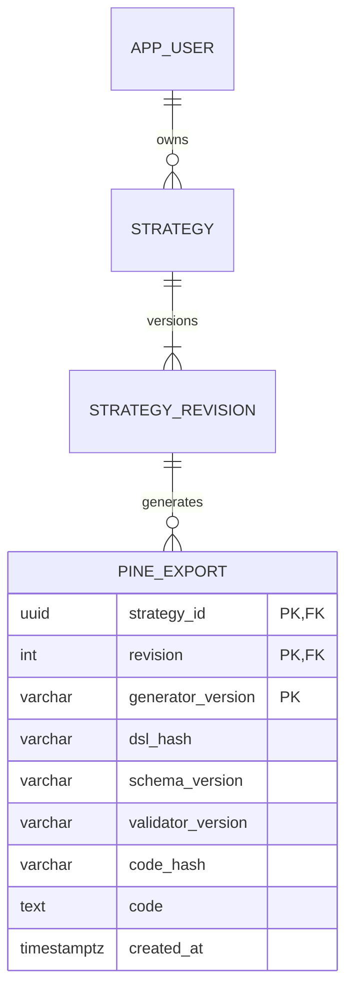

# PB-015 design — Refs #17

31/08/2026, before code. [Requirements](spec.md).

## Decision and boundary

Pine v6 **research indicator** emits no strategy orders or alerts. A closed-bar
simulator implements DSL v1 policies itself; it is not a native Strategy Tester
export. Native broker emulation can choose a different intrabar path, improve
limit fills and model slippage in ticks. Those do not preserve stop-first,
target-price caps or percentage adverse fills. Do not silently map between them.

Authoritative references consulted 31/08/2026:
[execution model](https://www.tradingview.com/pine-script-docs/language/execution-model/),
[strategy emulator](https://www.tradingview.com/pine-script-docs/concepts/strategies/),
[limits](https://www.tradingview.com/pine-script-docs/writing/limitations/).
Local source checks are not official compilation. Anonymous Add to chart currently
opens Sign in. Actual target checks remain required before Issue completed.

## Use case / sequence

Actor: authenticated owner. Precondition: explicitly selected saved VALIDATED
revision. Draft edits stay unchanged. Postcondition: persisted deterministic code
and provenance for that revision, or explicit failure without a partial artifact.

## Classes and data

New V9 only; V1–V8 unchanged. Composite FK revision cascades on strategy deletion.
Ownership always via strategy predicate. Lock credential/user then strategy, matching
existing write order, so export/deletion/password changes serialize safely. Max100
exports per owner, max128KiB code. Current-generator retry returns same row before
quota check. Code is stored, not regenerated by GET after generator upgrades.
Existing revision stores canonical DSL; artifact records exact matching provenance.
No external requests in generation, no new package or stack change.

API: GET/POST `/api/strategies/{id}/versions/{revision}/pine`. POST accepts exactly
empty JSON object (reject unknown fields); GET returns existing current-generator
artifact or404. Existing strategy security/rate/body rules apply. DRAFT/unsupported
returns422 with bounded machine-readable diagnostic, no submitted text in errors.
Owner mismatch/nonexistent404; bad IDs400; expected-account401; CSRF403; quota409.

## Target contract

- Supports schema1.0.0's rule tree and causal indicator DAG including pivots and
  trendlines. Stable internal numeric identifiers; never inject user labels/name
  as syntax. Numerical constants are validated plain decimal literals.
- Target limits:16 indicators, period<=200, operand lag<=200, pivot left/right<=100,
  minimumBars<=4500, at most5000 included candles and128KiB generated UTF-8. These
  are explicit target limits, not a DSL schema change. No arbitrary templates.
- User must select exact UTC start/end-exclusive window and confirm chart ticker
  mapping for DSL symbol; default window is a synthetic example, not inferred
  data. Require standard chart, matching interval, positive finite OHLC, nonnegative
  volume, correct OHLC ordering, contiguous exact timestamps and first bar=start.
  Missing coverage/end, history gaps or oversized window fail visibly. No higher
  timeframe requests or chart look-ahead; only confirmed bars enter simulation.
- Reset state at requested start. Explicit arrays keep only bounded selected
  history; every operand's lag is relative to this window. No chart warm-up leakage.
  SMA full window; EMA SMA seed; RSI/ATR Wilder seed; NA breaks/reset smooth seeds;
  pivots strict ties and right-bar confirmation; trendline last two original pivots.
- Rule truth is -1 undefined /0 false /1 true. NOT and ALL/ANY retain null logic.
  Cross checks prior operands; constants at a nonexistent previous bar are undefined.
- Pending next-open rule exit precedes barriers, pending entry uses current balance
  and adverse entry fill for sizing. Stops derive actual fill; both-hit stop-first;
  gap stops use worse open; targets not improved. Costs/fees match DSL formulas.
  No same-open reversal/reentry, liquidation, funding, ticks/lots or broker calls.
- Expose signal/entry/exit bar markers, numeric rule values, position, balance,
  equity and fill/fee/reason traces in Data Window/Pine logs for fixture comparison.
  End leaves open position marked and pending signal explicitly cancelled, no
  forced liquidation. Protective exit time remains candle interval, not exact tick.
- Pine floats differ from Python Decimal34; compare exact event identity/timing and
  numeric tolerance on fixtures. Near-threshold rounding can change rules; warn
  visibly, never certify arbitrary strategy parity from a finite fixture suite.

## UI and safety

Real provider-backed Pine view replaces authenticated mock only; existing shell
mock remains explicitly demo for foundation tests. Source saved revision/hash shown;
dirty text is never submitted. Hide stale artifact on revision/account change,
ignore late responses after unmount or selection change, bind every request to
captured account. Loading/error/empty/unsupported/retry are explicit. GET restore
first; POST intentional Generate/retry is idempotent. Clipboard failure and safe
text download do not erase code; no HTML rendering or executable preview.

Security matrix: BOLA/IDOR/CSRF/session/revocation/mass assignment/concurrency quotas
apply; SQL parameterized; names not compiled; code inert in UI; no filesystem paths
or network URL input (SSRF/traversal/upload N/A). Output cap/rate limits prevent
unbounded generation/storage. Logs/errors exclude source/user prompts/secrets.
Existing password/dependency/session/security tests remain enabled.
