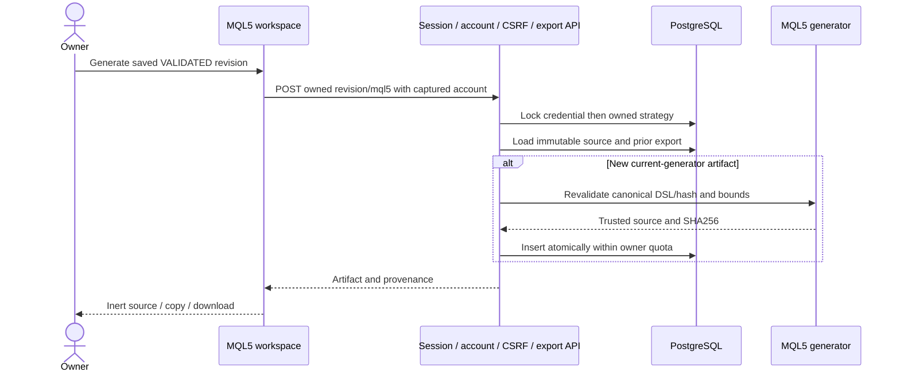
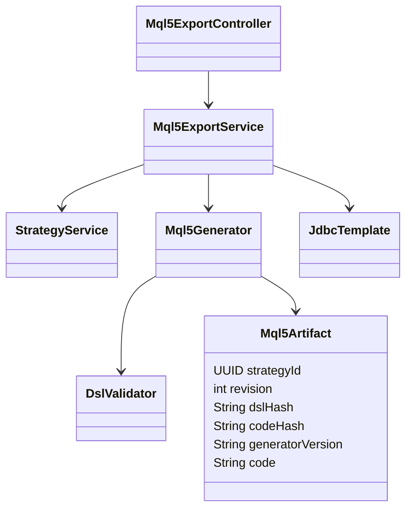
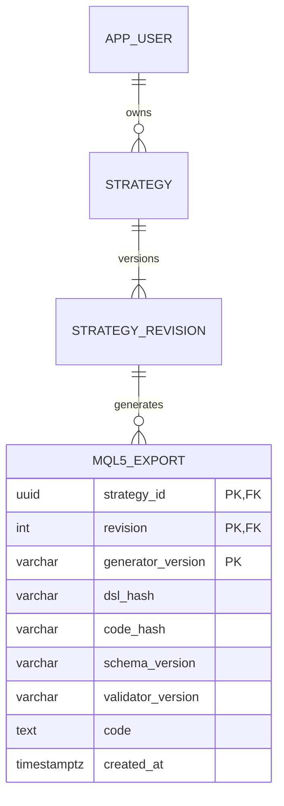

# PB-016 design — Refs #18

31/08/2026. Design before product code. [Requirements](spec.md).

## Use case and boundary

Authenticated owner selects an immutable VALIDATED strategy revision, generates
or reloads its MQL5 artifact, then copies/downloads inert source. Draft text stays
unchanged. Script reads an explicitly named UTF-8 CSV in MetaTrader's local file
sandbox and runs a bounded deterministic research simulation. No broker account,
orders, native Strategy Tester fills, live ticks, network, DLL or shell calls.
CSV timestamps are UTC; broker timezone/volume is never inferred. Missing or
malformed data fails closed; binary doubles are not Python Decimal34.

## Persistence and API

V10 new table only, applied migrations unchanged. Ownership via strategy join,
credential/user lock followed by strategy lock as in other private writes.
GET/POST `/api/strategies/{id}/versions/{revision}/mql5`; POST exactly `{}`.
Revalidate schema/canonical hash/metadata before generation; current-generator
replay before quota. Max100 artifacts/owner,128KiB source, source-deletion cascade.
Private expected-account guard, session revocation, CSRF, existing strategy rate
and body limits remain authoritative. B/missing404; wrong identity401; invalid
body/IDs400; unsupported422; quota409; safe transient failure without partial row.

## Generator and runtime

Compile directly from canonical DSL (not from Pine). Trusted standalone MQL5
script template; stable internal identifiers, no user names/labels as executable
syntax. Limits16 indicators, period/lag200, pivot sides100, warm-up4500 and up to
5000 OHLCV bars. Explicit missing-value handling; causal dependency order and
nullable rules. SMA/EMA/Wilder/RSI/extrema/pivots/trendlines follow Python seeds
and confirmation timing. Simulator preserves next-open action, stop-first same
barrier hit, adverse percentage fills, target cap, risk sizing, fees and marked
equity. End cancels pending action without forced liquidation.
Reject nonfinite balance/equity/quantity/fill/fee/P&L with NUMERIC_RANGE and no END
success marker; extreme compounding must not silently become a null-valued result.

CSV path must be a plain bounded filename, no traversal or absolute path. Reject
reserved Windows device stems even with `.csv`. Read only the local MQL5 Files
sandbox, bounded bytes/rows/fields, exact header and UTC
timestamps aligned to DSL interval. Validate ascending contiguous times and
finite numeric OHLCV bounds before simulation. Trace output identifies source
hash/version and each bar/event/indicator; no private account credentials.
User must confirm CSV symbol and timeframe mapping explicitly. No native broker
lot/tick/stop constraints are claimed applicable to this research script.

## UI, security and verification

Replace authenticated MQL5 mock only. Saved revision/hash/version and research
limits visible; explicit empty/DRAFT/loading/error/retry. Key by account and
revision, ignore stale responses, verify artifact SHA256 before display; no HTML
execution, arbitrary download path, automatic save or external source submission.

Test BOLA/CSRF/session/account binding, bounds/mass assignment, malicious labels,
quota races/idempotency/rollback/cascade, real PostgreSQL, UI stale responses,
browser responsive/restart and dependency regression. Official MetaEditor
compilation and actual MQL runtime traces remain separate gates; prepared source
or a different-language interpreter cannot certify target execution.

Official references consulted31/08/2026:
[compiler command line](https://www.metatrader5.com/en/metaeditor/help/beginning/integration_ide),
[file sandbox](https://www.mql5.com/en/docs/files/fileopen),
[script OnStart](https://www.mql5.com/en/docs/event_handlers/onstart),
[portable startup](https://www.metatrader5.com/en/terminal/help/start_advanced/start).
Use isolated workspace portable binaries/profile, never owner account/profile.
