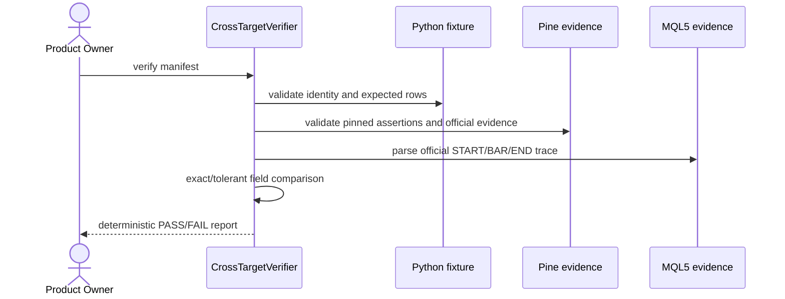
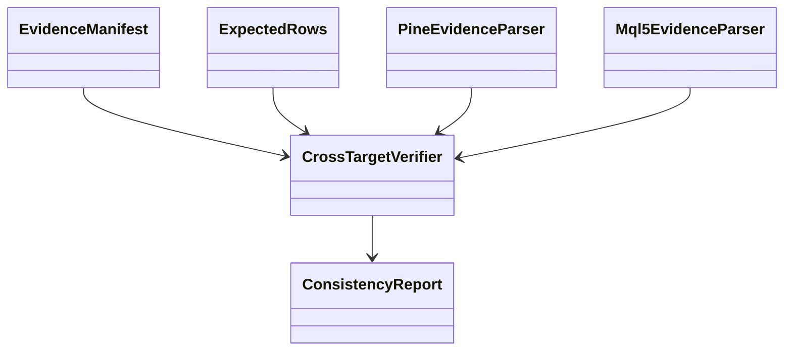

# PB-017 design — Refs #26

## Sequence

## Classes

The standard-library Python CLI reuses the proven MQL5 verifier. It validates the
MQL CSV bytes against the Python dataset, pinned Pine fixture arrays against the
same Python rows, then validates official target evidence. Six Pine fixtures have
retained compact raw traces; the two earlier fixtures retain official complete
trace plus runtime assertion evidence. Reports distinguish those modes rather
than inventing missing raw bytes.

No database/UI/migration/dependency impact. Files are allowlisted by a strict
manifest and resolved inside the repository root. Inputs have byte/row/field
limits and duplicate JSON/trace fields fail.
