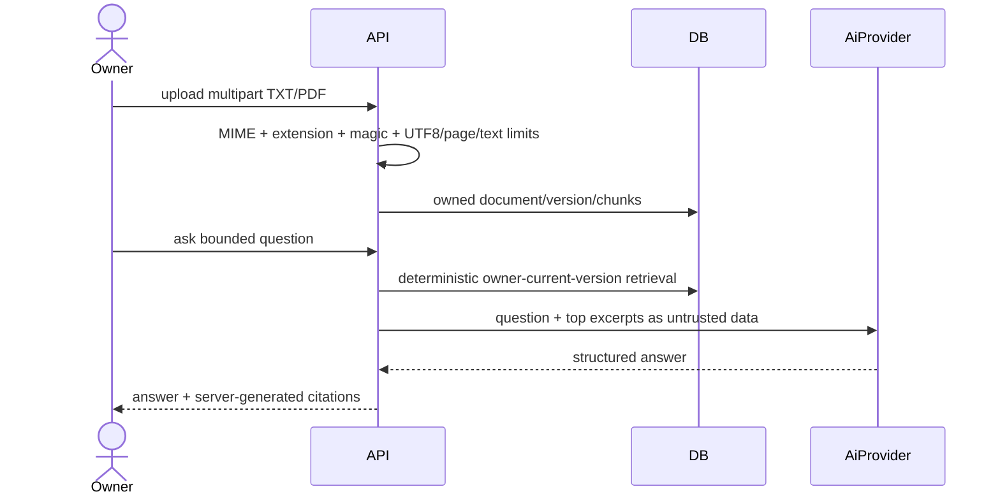
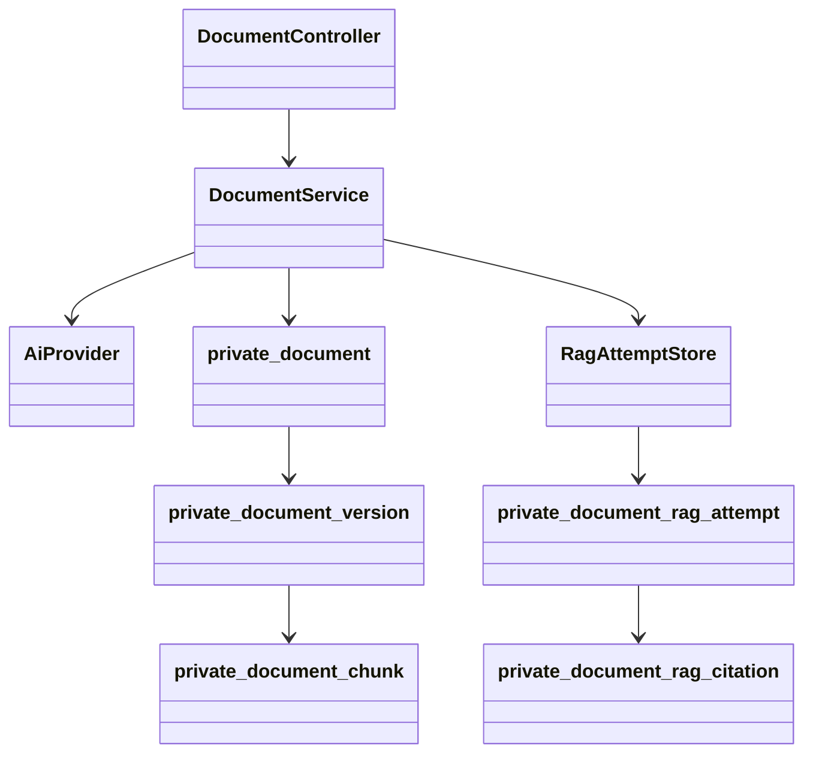

# PB-018 design

The multipart resolver owns the upload stream under a 2.2 MiB request limit; the
generic request wrapper never pre-consumes approved document multipart bodies.
PDF parsing uses a fixed 8 MiB PDFBox stream cache plus file/page/extracted-text/
chunk limits. RAG rechecks credential and current document versions after the
provider call before recording or returning output.
