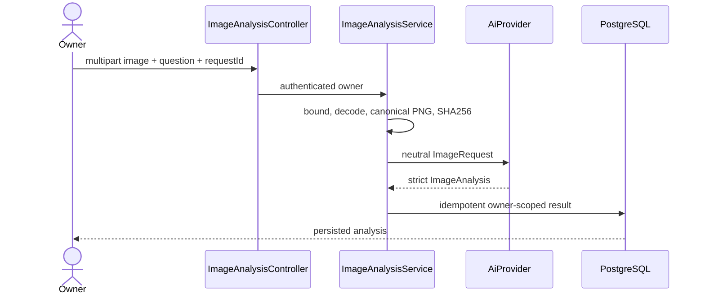
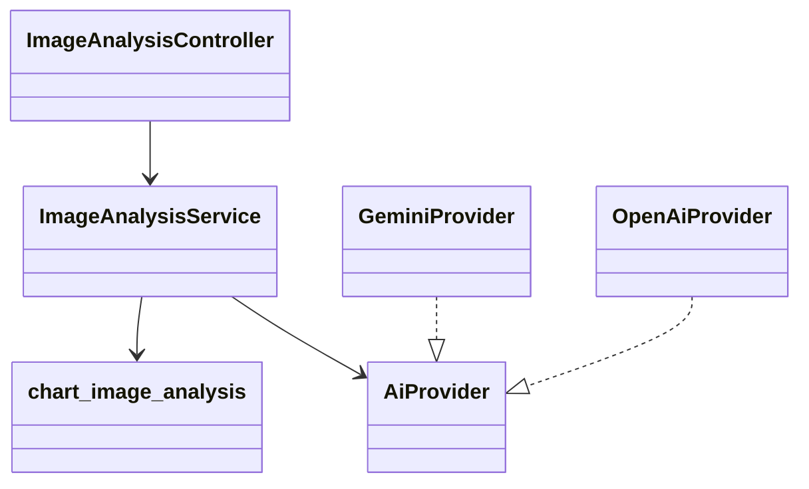

# PB-019 design

V17 adds one owner-cascaded table. It stores canonical PNG bytes and hashes rather
than filenames, URLs or metadata. Maximum source/canonical bytes are 2 MiB, maximum
dimension 4096 and maximum pixel count 16 million. At most 50 analyses per owner.
