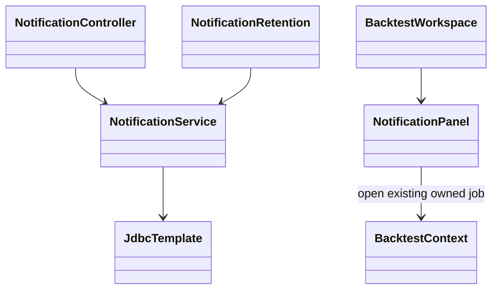
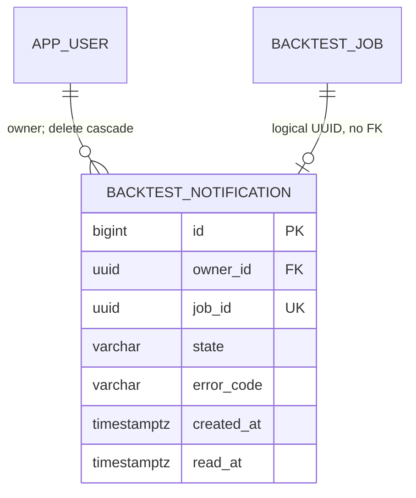

# PB-022 design

31/08/2026. Issue20. V12 adds a separate notification table, terminal-transition
trigger and retention; V1–V11 unchanged. Existing /api/backtests/** security, rates
and expected identity apply. Audit classifies notification read-state writes under
BACKTESTS, without raw path/notification content. No schema change to audit events.

```mermaid
sequenceDiagram
  participant W as BacktestStore / worker
  participant J as PostgreSQL job
  participant N as Notification trigger
  participant A as Owned notification API
  participant U as Backtest inbox
  W->>J: terminal state transition
  J->>N: insert unique job notification in same transaction
  alt persistence fails
    N-->>W: rollback job and notification
  else successful
    N-->>W: commit
  end
  U->>A: authenticated explicit GET, expected account
  A->>J: select notification page + count in one snapshot
  J-->>A: owned metadata
  A-->>U: owned page + unread count
  U->>A: POST read, CSRF + expected account
  A->>J: COALESCE readAt; stable on replay
  J-->>A: owned acknowledged event
  A-->>U: acknowledgement
```





Trigger only on active→terminal update, no deletion/old terminal backfill. A unique
job UUID enforces one row; retries create distinct jobs and distinct notifications.
No application endpoint creates arbitrary notifications. Transition failures remain
recoverable through existing transaction/lease behavior. Notifications are not a
broker/AI success signal or profit guarantee.

Service list holds current user FOR SHARE and uses repeatable-read for page/count;
read mutation locks current user, updates owned unexpired ID and returns stable
readAt. SQL parameters only, canonical positive bigint cursors/IDs, bounded limits.
Sequence allocation is not commit order; refresh sees later commits, keyset is not
a complete snapshot across requests. Retention locks/SKIP LOCKED, one5000batch/min.
Owner deletion purges notifications.30day physical retention can lag during outage;
operator monitors disk/ingress/cleanup as in audit runbook. No silent newer eviction.

Panel keyed by account and ignores unmounted requests, rechecks account before
displaying read responses. Check/refresh replaces a bounded page, older button uses
cursor, mark-read is an explicit action. Unknown unread count until server replies;
never show invented0 while loading. No automatic background API work added to old
Backtest view tests or application behavior. Opening a job reuses existing select
and reports404 if deleted; never reruns a job or navigates outside the application.

## Operations

Watch the fixed `notification_retention_unavailable` warning, disk capacity and
cleanup lag. On an authorized database connection, inspect metadata only:

```sql
SELECT count(*) AS expired_rows, min(created_at) AS oldest
FROM trading.backtest_notification
WHERE created_at < clock_timestamp() - interval '30 days';
```

Do not export owner/job data or credentials to logs/Issues. Restore database,
permission or capacity faults; do not disable the terminal trigger. An insert
failure rolls back the job transition and existing worker leases permit recovery.
Public health checks audit read/connectivity, not notification insert permission
or cleanup freshness. Retention failure therefore needs its own warning/lag check.
