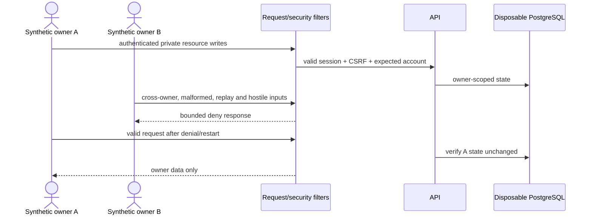
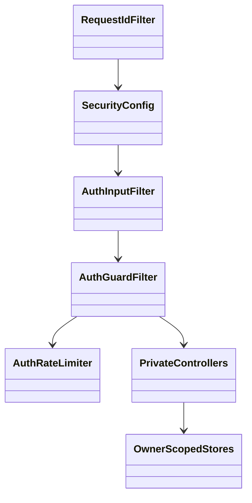

# PB-023 design

No data migration is planned. Security response headers are centralized in the
Spring Security chain. The adversarial smoke treats every response as bounded
untrusted bytes and records only booleans/counts/hashes, never credentials or
private response bodies.
