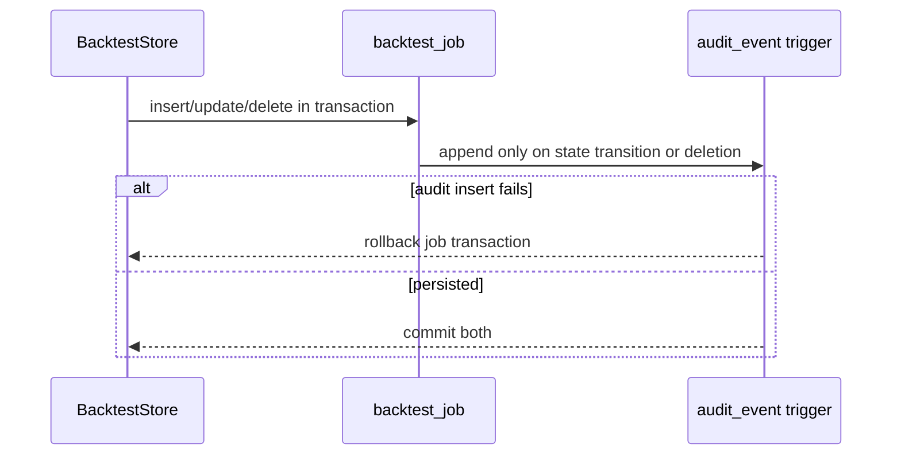
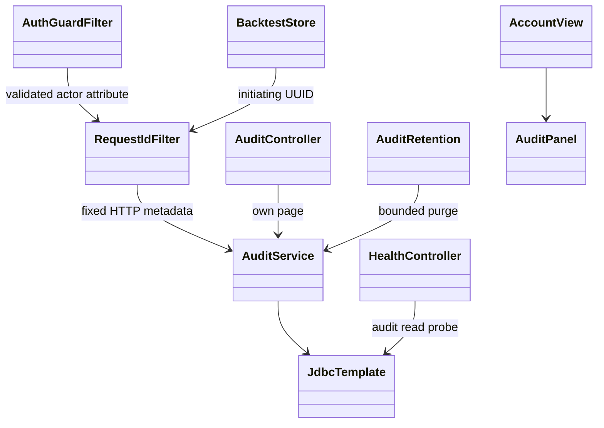
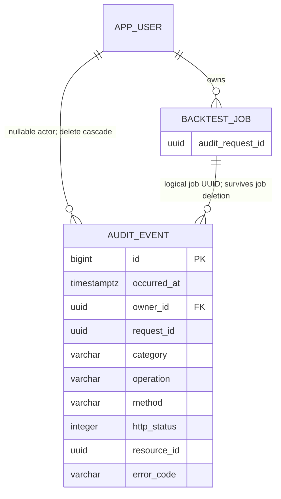

# PB-024 design

31/08/2026. Issue #19. Extends existing request UUID, security filter, JDBC/Flyway,
backtest store and Account UI. No new dependency, admin identity or network target.

```mermaid
sequenceDiagram
  participant U as Account browser
  participant R as RequestIdFilter
  participant G as Security / AuthGuard
  participant C as Existing controller
  participant D as PostgreSQL
  U->>R: request + expected account + CSRF
  R->>R: generate request UUID
  R->>G: validate session/account/access
  G->>C: authorized operation
  C->>D: business transaction
  D-->>C: commit or rollback
  C-->>R: safe response
  R->>D: append allowlisted HTTP outcome
  Note over R,D: audit failure logs fixed warning; response unchanged
  R-->>U: response + X-Request-ID
  U->>G: GET own /api/audit?before=N
  G->>D: owner predicate + limit + current credentials
  D-->>U: bounded safe event page
```







V11 adds schema/functions/triggers and an owner+id index; V1-V10 unchanged.
Audit UPDATE always forbidden. DELETE only expired rows or parent account cascade.
No self-service purge. Retention uses LIMIT 5000/FOR UPDATE SKIP LOCKED; one batch
per minute per instance. Database query timeout bounds work; operator monitors disk
and retention lag. Existing rate limits bound individual clients, not a global
storage cap: distributed flooding can still exhaust disk and needs deployment
edge controls/capacity monitoring. Do not silently truncate newer security events.

Fixed route groups discard paths/queries. Trusted UUID actor is attached only after
credential validation, with login/logout handlers preserving identity after context
clear. CSRF-before-auth denials remain anonymous rather than parsing credentials.
Resource IDs are stored only for transaction-backed job events, never extracted
from arbitrary route strings. SQL is parameterized. API does not accept owner ID.

HTTP UUID and async job initiating UUID are distinct from client idempotency keys.
Service calls without HTTP context generate an internal UUID. Job trigger event
order uses monotonic identity; keyset page order is ID, not a wall-clock total order.
Concurrent transactions may commit out of allocation order: refresh retrieves
late commits; pagination is not a serializable snapshot/export.

Account panel loads on explicit request; escaped text, wrap long UUIDs, bounded50
items/page, next/reset controls; component keyed by account, stale work ignored.
No raw user content or automatic background polling. Runtime API shape validated.
