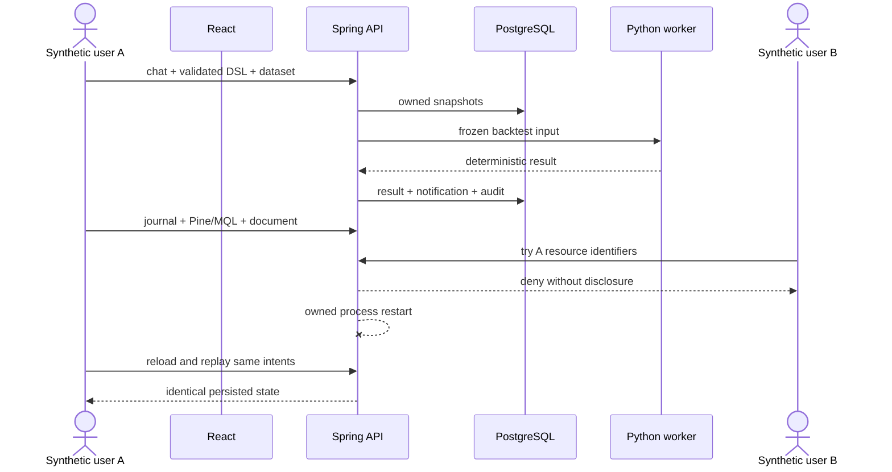
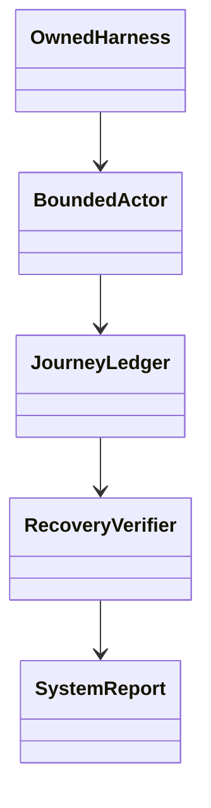

# PB-025 design — Refs #27

## Sequence

## Components

`scripts/smoke_system.py` composes public APIs through a bounded cookie client. It
does not query the database directly or import application internals. The existing
owned `test_backend.py --serve` harness supplies a fresh Flyway database, loopback
API, trusted Python executable and restart sentinel. The smoke performs one restart
only, hashes snapshots, checks replay and writes a deterministic-schema JSON report.

Provider-unconfigured behavior is exercised across chat AI, strategy proposal,
journal evaluation, grounded document RAG and image analysis. Successful provider
semantics remain covered by the DONE feature evidence; PB-025 never substitutes a
stub answer. Worker/DB fault, timeout, migration and race behavior remains in the
full executable backend regression and is summarized alongside the actual journey.

No ERD, migration, UI design, dependency or stack impact is expected. Any defect
found is fixed surgically in the owning boundary and retested here plus its suite.
