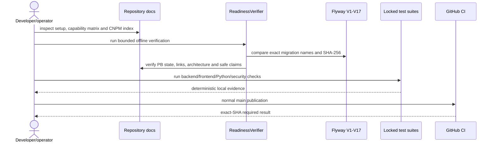
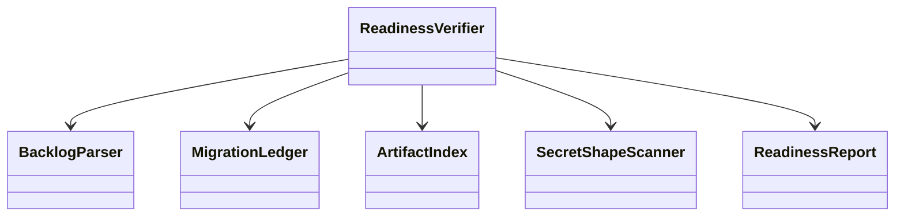

# PB-026 design — Refs #28

## Readiness sequence

## Components

`scripts/verify_readiness.py` uses only the Python standard library. It reads
bounded repository text, refuses symlinks and paths outside the root, parses JSON
with duplicate-key rejection, binds all Flyway files to a pinned SHA ledger, and
emits sorted JSON plus stable Markdown. It does not call GitHub or any external
service, so CI/fresh-checkout execution does not depend on mutable network data.

## Data, UI and deployment impact

No ERD/migration/runtime/dependency/UI change. `docs/architecture.md` is the
current aggregate view derived from existing classes and V1–V17; feature diagrams
remain detailed evidence. `docs/cnpm-index.md` is the navigation layer for the nine
deliverable groups. Existing real browser evidence is indexed; no screenshot is
invented or rerun solely for assembly.
