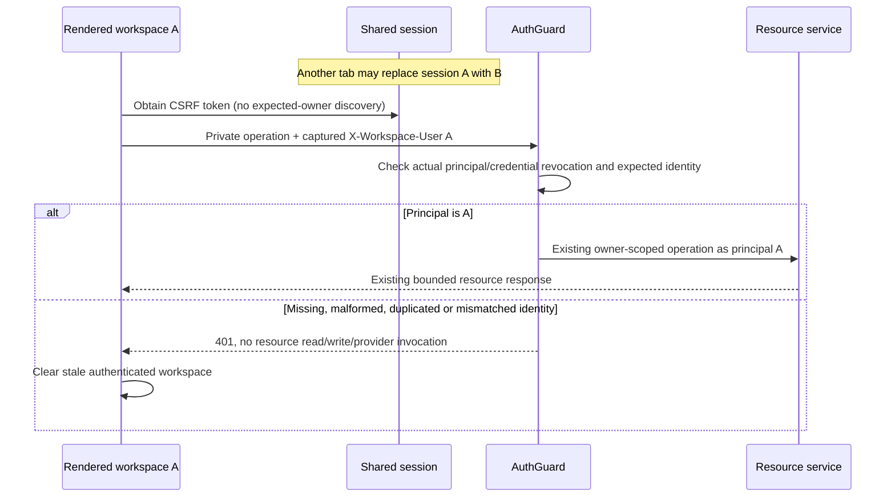
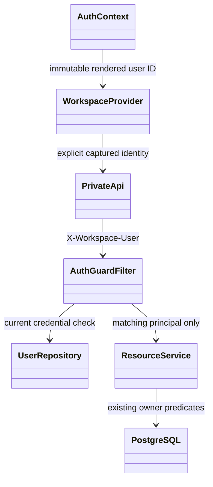

# PB-027 design — Refs #16

31/08/2026. Additional identity precondition, not a replacement authorization model.

## Sequence

## Relevant classes

## Boundary and compatibility
All private routes require one canonical matching UUID header. Public health,
registration, login and CSRF remain usable. Self-discovery /auth/me remains usable
without the header for authentication bootstrap; when supplied it must match.
Move AuthGuard before LogoutFilter (still after CSRF) so stale logout cannot
invalidate the replacement session. Rejection of an expected-account mismatch
must not invalidate B's valid session. Revoked actual credentials retain existing
invalidation behavior. Header cannot choose a different owner or grant privileges.

Frontend passes a primitive expected ID from authenticated context explicitly,
through all API calls, pagination and multi-stage CSRF/POST operations. No global
mutable identity, no discovery of the new account to fill an old request. Existing
lifetime/epoch checks discard old responses; 401 clears the stale workspace.
Uncertain writes retain their original request UUID and payload until verified;
post-write identity failures do not prove that the write failed. Public auth calls
remain separate. Existing non-UI clients must capture /auth/me after login and
supply that ID on subsequent private calls.

## Data, UI and security
No entity, ERD, migration, dependency or business-calculation changes. Existing
screens and error/uncertain states are reused. CSRF, Origin, rate limits, owner SQL,
versioning, idempotency, response parsing and redaction are retained. This protects
against accidental shared-session account confusion, not a stolen session plus
known account ID; normal authentication/ownership defenses remain mandatory.
In-flight requests already accepted as A may finish as A, but cannot become B's
operation and cannot publish after the A provider lifetime ends.
