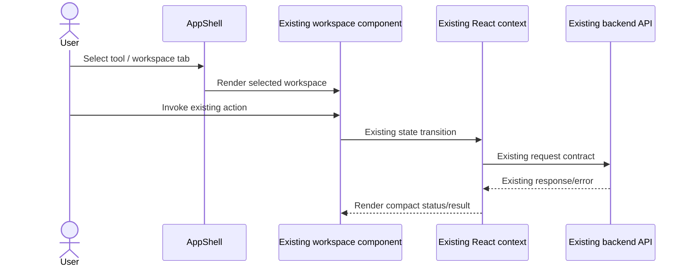
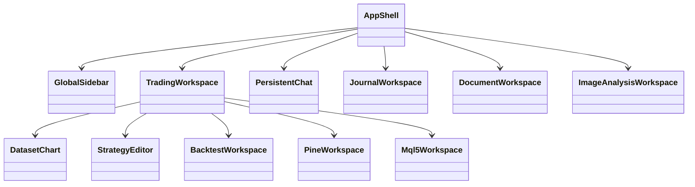

# PB-028 — UI design

## Design decisions

The redesign retains the existing React component/context graph and introduces no dependency. Existing Tailwind utility classes remain the implementation mechanism; shared CSS tokens and a small set of semantic component classes provide a consistent terminal surface.

- Navigation: 68px desktop/tablet rail for maximum chart area; mobile drawer. Visible `Q` mark and `Quant` identity in workspace headers.
- Surfaces: near-black canvas, charcoal panels, one-pixel borders, compact radii and restrained shadow.
- Color: neutral grayscale for structure; emerald for primary/success/profit; rose for error/loss; amber only for cautions.
- Disclosure: persistent UI shows labels/status/actions. Operational detail, provider privacy, provenance and limitations move to native `details` sections.
- Responsive: desktop preserves the resizable Assistant panel; tablet moves it to a modal drawer; mobile renders one selected tool at a time.

## Existing component flow

## Component impact

No context, API DTO, service, database or ERD class changes.

## Compatibility and recovery

All event handlers, accessible names used by tests, provider calls and API payloads are preserved. Recovery is a normal compensating Git revert if required; no data migration exists. No third-party branding, logo, text, layout or asset is copied.
