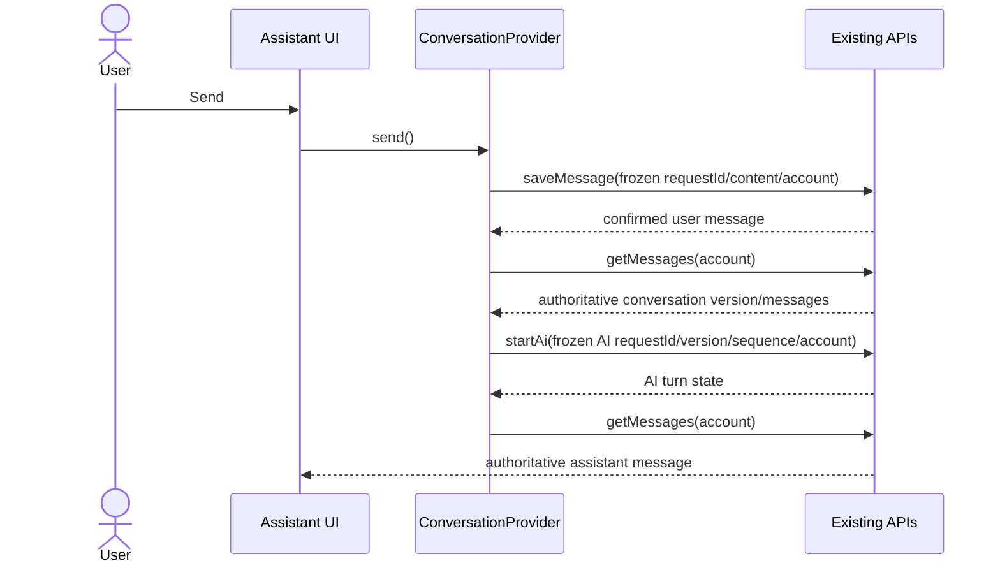

# PB-029 — Design

## Reference observations

The public LuxAlgo Quant UI was inspected only for principles: an almost-black canvas, thin separators, compact icon actions, a narrow assistant rail, and a chart-led hierarchy. No branding, text, assets or exact layout is reused.

## Smallest design

- Retune the existing shared CSS tokens from green-tinted charcoal to neutral black/gray and make the shared primary action neutral.
- Keep the existing responsive component architecture; reduce desktop rail/chat width and visual separators rather than introducing another shell.
- Replace persistent chat administration controls with a compact toolbar, collapsible history and one conversation menu.
- Add one `send` orchestration method to the existing conversation provider. It reuses existing API functions and frozen request refs; no service or dependency is added.
- Pass one navigation callback from AppShell to AI Chat for the existing Image Analysis screen.

## Send sequence

If save is uncertain, the same save request is retried and AI is not started. If the AI outcome is uncertain, the same AI request can be checked, retried or cancelled.
