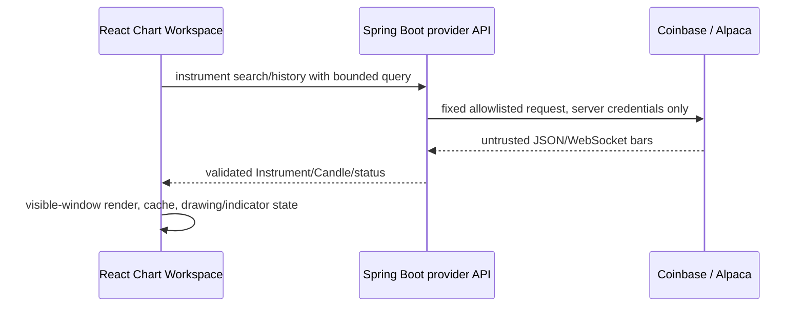
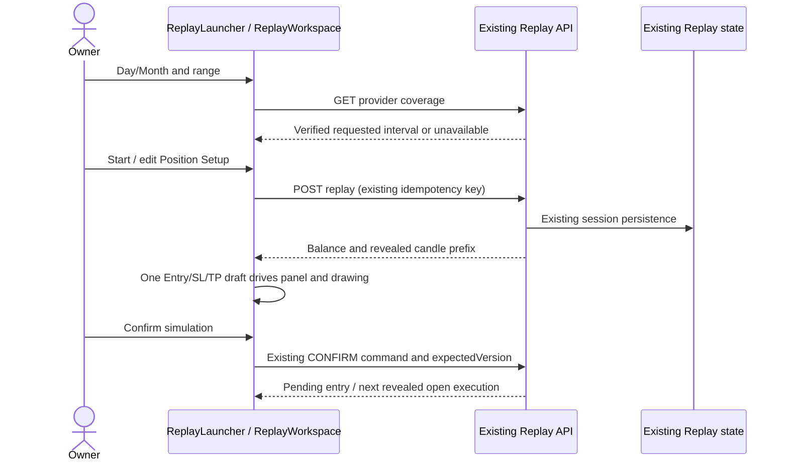
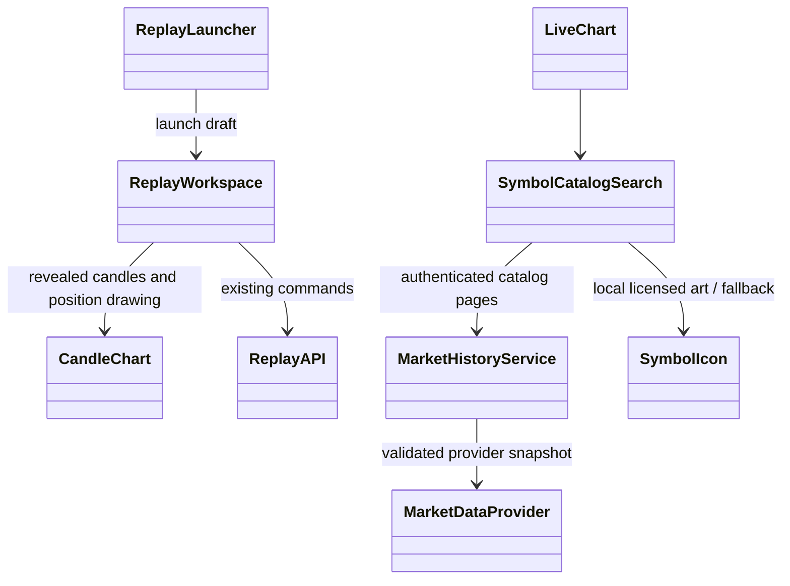

# PB-038 — Design

## Trust boundaries and ownership



Coinbase remains a public read-only client provider for compatibility with the
existing feature. Alpaca credentials are accepted only by a server-side adapter;
the browser never receives or stores the secret. If the current app architecture
does not expose a safe server route for a new read-only provider, the UI reports
the provider as unconfigured rather than calling an arbitrary user URL.

## Neutral domain

```text
Instrument {
  id, symbol, displaySymbol, name, assetClass, provider, exchange, dataFeed,
  baseAsset, quoteAsset, currency, timezone, priceIncrement, pricePrecision,
  volumePrecision, dataMode
}

Candle {
  instrumentId, interval, openTime, closeTime,
  open, high, low, close, volume, closed
}
```

`assetClass` is CRYPTO/STOCK/ETF/FOREX/FUTURES and `dataMode` is
REALTIME/DELAYED/SNAPSHOT/END_OF_DAY. Provider adapters own raw payload shape,
timestamp normalization, symbol mapping, feed labels and source-specific limits.

## History/cache/subscription model

The frontend keeps a bounded per-instrument/timeframe history cache and a shared
in-flight request map. Identical history requests share a promise; a request is
removed after settle and stale selection aborts the underlying controller when
the last consumer releases it. The cache is bounded at 20,000 candles per
active key. The current workspace deliberately lazy-loads only the active cell,
so each cell effect owns one subscription and cleanup closes it at zero refs;
there is no claimed cross-cell stream fan-out until multiple simultaneously
loaded cells require it. Realtime merge replaces the same UTC `openTime` and
appends only a later bucket.

Older pages use the provider's official page size (Coinbase max 300 source rows;
Alpaca pagination/token as documented). `rightOffsetBars` is logical viewport
state, not synthetic Candle data. Drawings keep ISO UTC semantic times, including
future coordinates that are not yet represented by a candle.

## Layout and rendering

```text
1  : grid columns 1 / rows 1
2H : grid columns 2 / rows 1
2V : grid columns 1 / rows 2
4  : grid columns 2 / rows 2
8  : grid columns 4 / rows 2
```

The chart grid is a flex child with `height: 100%`, `min-height: 0` and explicit
template rows/columns. Splitter overlays or grid tracks own local proportions;
double-click restores equal tracks. Each cell receives its own chart state and
the active cell owns topbar commands. Candle rendering slices the logical visible
window plus a small overscan; indicator memoization uses the loaded domain array.

## UI information architecture

- Topbar: symbol search, timeframe, current price, chart type, layout, indicators,
  undo/redo, then flexible space, object/data utilities, refresh and camera.
- Indicator modal: search header, left source/category navigation, result list with
  add/star actions, empty My Indicators/Community states and compact active legend.
- Settings modal: Symbol, Scales & Lines and Canvas; unsupported modes are absent or
  disabled with a reason.
- Context menus are pointer-positioned, viewport-clamped, Escape/outside-dismissed
  and keyboard reachable.
- Bottom-right clock/timezone and Settings gear are isolated from chart render
  state so a one-second clock tick does not recalculate candles/indicators.

## Data/ERD impact

No database migration is required for market-data provider configuration: secrets
are process environment only, and Instruments/Candles are read-only provider
responses/cache state. Existing imported datasets and Strategy DSL schemas remain
unchanged. If implementation proves a persisted user preference is necessary,
that is out of this Issue unless an existing contract can safely carry it without
changing ownership semantics.

## Dependency decision

No chart library or Alpaca SDK is added. The existing SVG renderer satisfies the
current chart contract, and Java 21 `HttpClient`/WebSocket keeps raw provider
mapping server-side without a new dependency. A dependency would require a new
acceptance need and lockfile/license/audit evidence.


## Revision 07/09/2026 — implemented Chart refinement (Refs #39)

The top toolbar now opens the Day/Month Replay launcher. Clock is also on this
bar and opens a portal below its trigger. Timeframe and Clock share anchored
viewport positioning; their menu/dialog keyboard semantics remain appropriate
to their respective controls. These details supersede the earlier placement notes.

| Use case | Actor / precondition | Main flow / outcome | Failure flow |
| --- | --- | --- | --- |
| UC-R1 Start historical Replay | Signed-in owner, accepted instrument | Choose UTC Day/Month, check coverage, Start creates existing Replay session | Invalid/future/>20k range or unknown coverage disables Start; uncertain writes retry the identical request |
| UC-R2 Position Setup | Owner of a started/resumed Replay | Rail button below More opens balance, side, current/manual entry, risk/quantity and percentage levels; confirm existing simulation command | No session: explain prerequisite and offer start/resume; invalid levels/insufficient balance disable confirmation |
| UC-R3 Browse provider catalog | Signed-in owner | Select configured source, debounce query, move through 50-row cursor pages, select stable provider identity | Provider/entitlement failure is explicit; old results cleared; retry or select another source |
| UC-R4 Display timezone | Chart loaded | Select UTC/Exchange/Local/named timezone; axis/crosshair reformat | UTC candle timestamps are unchanged |





No ERD or migration changes. Catalog snapshots are bounded in memory (20,000
instruments/provider, five-minute service TTL), cursors bind provider/query/class,
and the DOM contains at most 50 result rows. Current Binance Spot quantity filters
do not prove historical lot semantics; position sizing stays Quantity. Stock/ETF
classification remains the provider's US equity grouping pending Alpaca entitlement
verification; there is no guessed ETF classifier. Futures and CFD remain gated.

The live-chart rail opens the Replay prerequisite panel when no session is open.
The complete Position Setup is in the existing Replay workspace and consumes its
actual available balance and revealed price. It does not invent a live account
balance or connect drawings to a broker.
