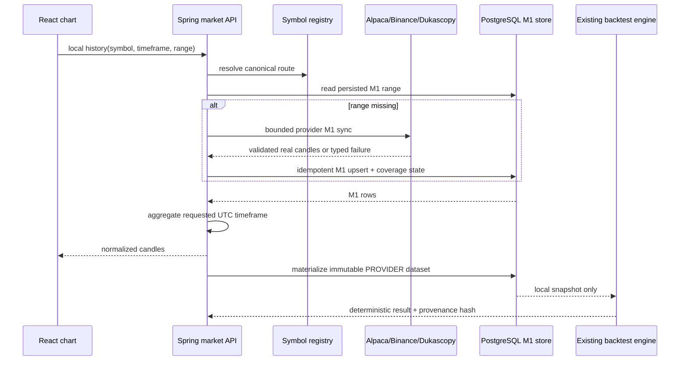
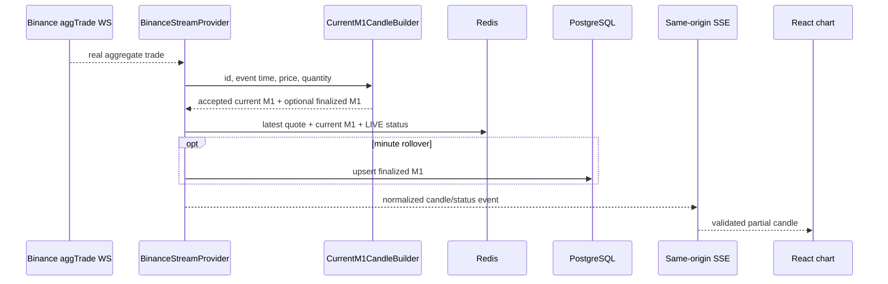
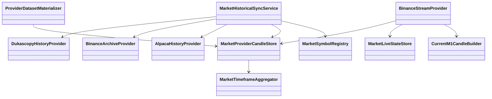
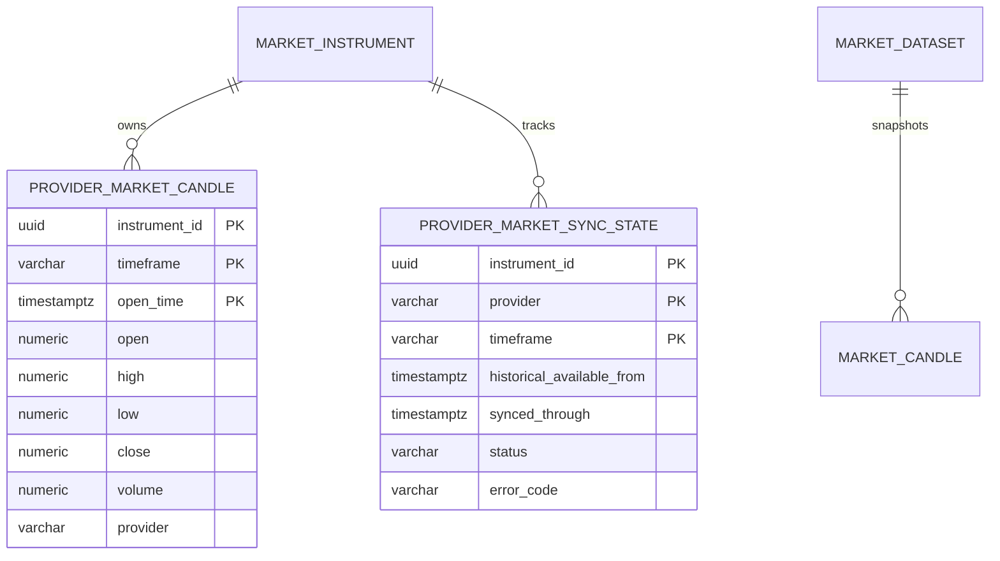

# PB-049 — Design

## Historical sequence

## Realtime sequence

## Main classes

## Data / ERD impact

Flyway V21 reuses V20 `market_instrument` and permits `PROVIDER` in the existing
immutable backtest dataset table. Redis remains an expiring hot-state projection,
not the durable history source.

## UI impact

- Binance and Dukascopy history use `/api/market/local/history`.
- Binance live uses the existing authenticated `/api/market/stream` SSE contract.
- Provider frames are validated for provider, symbol, timeframe, UTC bucket and OHLC fields before chart mutation.
- Unsupported/unverified realtime remains non-LIVE; no browser-side provider key or direct provider request is added.

## Dependency decision

`org.tukaani:xz:1.10` is required to decode Dukascopy BI5 LZMA payloads. It is a
small maintained Java library under the public-domain-compatible XZ for Java
licensing model, locked in `gradle.lockfile`; no new service or framework is added.
