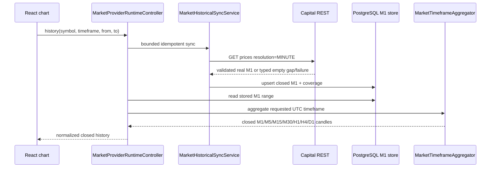
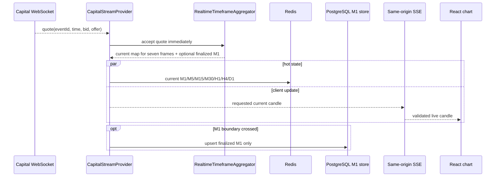
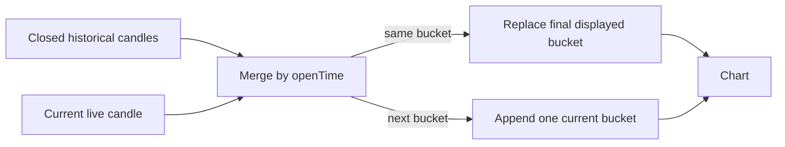
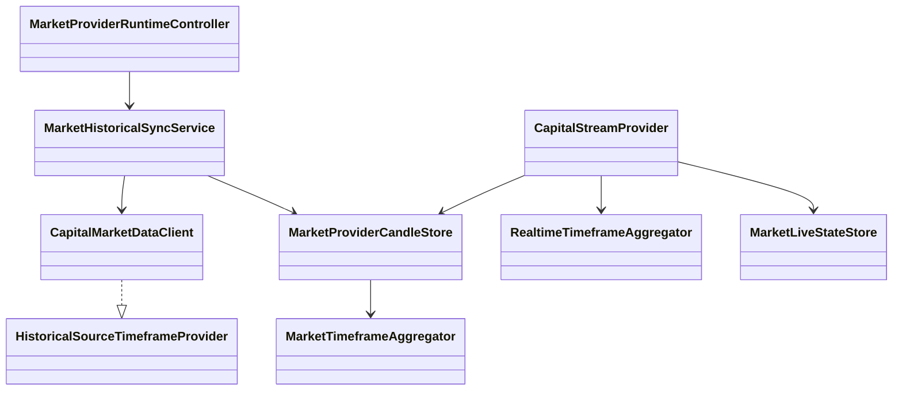

# PB-049 — Design

## Historical sequence

Historical code never requests Capital M5/H1/H4 data. M1 is the canonical
historical source and every larger closed candle is derived deterministically.

## Realtime sequence

The realtime path does not call the historical aggregator and does not wait for
M1 close. Every accepted quote independently selects all seven UTC buckets and
updates their open/high/low/close values in the same synchronized operation.

## Chart join

Live-only `closed=false` candles do not satisfy historical cache coverage. The
chart therefore loads closed history first and then replaces/appends the current
live bucket, preventing the former commodity one-candle failure.

## Main classes

## Data impact

- V21 stores durable provider M1 and sync coverage.
- V22 raises the immutable backtest dataset candle constraint to 20,000.
- Redis keys use `aitrading:v2:market:CAPITAL:<SYMBOL>:<FRAME>:current` for all seven frames.
- Redis is an expiring hot projection; PostgreSQL remains the durable historical source.

## UI impact

- Capital history uses `/api/market/local/history`; Capital live uses `/api/market/stream`.
- Historical timeout is bounded at 120 seconds in the provider and 60 seconds in the chart load guard.
- Forex pairs render two overlapping locally authored country flags.
- Commodity symbols retain local asset icons.
- No frontend code contains or transmits Capital credentials.

## Dependency decision

No new dependency is required for the Capital extension. Existing provider and
serialization libraries are reused; the dependency inventory remains locked.
