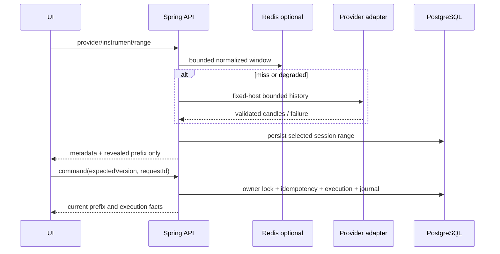
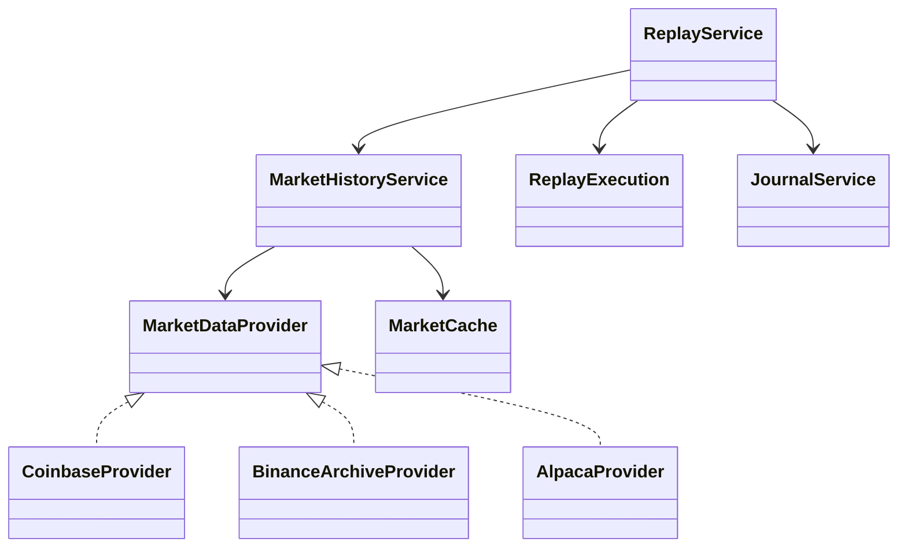
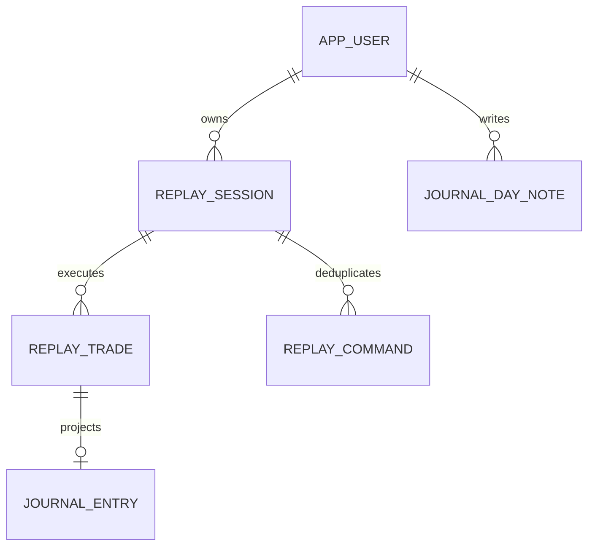

# Multi-provider Replay — thiết kế

06/09/2026. Refs #39, #43, #46, #47. Normative: requirements.md.

## Use cases và acceptance

UC1 người dùng xác thực chọn provider/instrument/timeframe và kiểm tra range.
Provider giữ identity riêng; không dữ liệu hoặc unknown coverage thì báo rõ và
không mở session giả. UC2 tạo session với capital/cost; reveal từng candle,
không serialize phần tương lai. UC3 preview local rồi confirm BigDecimal,
next revealed open fill; SL/TP, manual close và journal trong một transaction.
UC4 tiếp tục session bằng owner/version và xem Journal execution immutable.
UC5 xem ngày/tuần/tháng, activity rim, daily note và server filters.

Precondition: authenticated expected-account; public provider accepted hoặc
conditional configured. Postcondition: durable facts PostgreSQL; cache mất
không mất dữ liệu. Error flow: provider unavailable giữ cursor; stale version
409 giữ draft; duplicate request replay đúng intent; owner khác 404.

## Architecture

## Execution decisions

Market-only, one active position per session initially. Confirm stores pending
intent; next revealed open fills adversely. Quantity derives from intended entry
and SL, floors to supported quantity increment. Gap can exceed intended risk;
actual execution facts and cost remain explicit. Risk above 10% warns, not an
undocumented rejection; enforce positive bounded capital/quantity/no leverage.
Lot unavailable without verified contract metadata. Account currency initially
must match quote currency, with no invented FX conversion. Both touches stop
first; adverse gap stop uses candle open; favorable gap TP capped at target.
Manual close uses last revealed close and adverse slippage. No backwards cursor
mutation after execution; start another session to rerun history. All costs and
policy stored on session; indicator inputs only revealed prefix.

## Storage and bounds

Only selected replay history persisted; no full-market import. Binance daily
archives downloaded to owned temporary files with compressed/decompressed/row
bounds and SHA256 CHECKSUM verification, parsed streaming, deleted on completion.
UTC sorted/deduped candles; gaps kept, never synthetic. Redis stores bounded
normalized windows with versioned provider keys, validated on reads. Local
singleflight on cache failures. JDBC session/security persistence unchanged.

## Security and delivery tasks

T1 (#39): audit + backend contracts + bounded provider history/coverage.
T2 (#47): Redis TTL/keys/degradation/singleflight; backend WS aggregation/SSE parity.
T3 (#46): append-only migration, prefix-only session API + execution + idempotency.
T4 (#46): Replay UI/risk preview/draggable levels + persistence/resume.
T5 (#43/#46): immutable projection, filters/notes/semantic chart markers/galaxy.
T6: QA01–49, dependency/security/full tests and responsive browser evidence.

API ownership/CSRF/expected-account apply to every private route. Fixed external
hosts/no redirects; response/ZIP bounds, malformed-cache rejection, no secrets
in values/errors. Session locks serialize commands; request hash mismatch 409.
Applied migrations preserved. Isolated test database; preserve active manual
browser-test database. Unrelated untracked files never staged.

## Revision history

06/09/2026: initial current-source audit at 39b45b6; baseline execution started.
Design is intended behavior, not a completion claim.

07/09/2026: Implemented bounded Redis leases (65 seconds, UUID owner, atomic
compare-and-delete release), with five-second bounded contention waits and local
singleflight. Catalog/coverage/history TTLs are 5/5/30 minutes. Latest price TTL is
15 seconds, provider health 30 seconds, current bar 2 intervals bounded to one day.
Cache outage does not replace JDBC sessions or PostgreSQL execution persistence.
Actual two-instance lease, owner-safe release, malformed cache, expiry and Redis
shutdown tests passed. Frontend SSE uses workspace binding and coalesces updates
to four per second; unauthorized responses stop retries. No browser Redis access.
A mid-bucket connection or missing trade id makes the candle explicitly partial;
a complete next bucket can become LIVE. Actual closed 1m OHLCV matched Coinbase
REST in test-evidence/realtime-parity.json. Broader recovery QA is still pending.

07/09/2026: Replay command clients can send `X-Replay-Known-Cursor`. The response
contains `{state, candleStart}` with only newly revealed candles; the private GET
still restores the complete revealed prefix. The frontend checks session/source,
contiguous start, monotonic version, ordered times and final cursor length before
merging. No future candle is sent. Exact retries use the same intent and cursor.
Indicators reuse the existing neutral study library over the revealed prefix only.

07/09/2026: Binance transfer uses a bounded byte subscriber (8 MB ZIP, 1 KB
checksum), complete-transfer future timeout (20 seconds/request, 40 seconds for
all archives in a requested window), cancellation and restored interruption.
Compressed bytes are bounded in memory; ZIP contents are parsed incrementally
with 16 MB expansion, 2048-byte lines and 1440-row bounds. No archive extraction
or temporary filesystem payload is needed. This replaces the earlier temp-file
transfer description. The overall download budget is shorter than the Redis lease.
